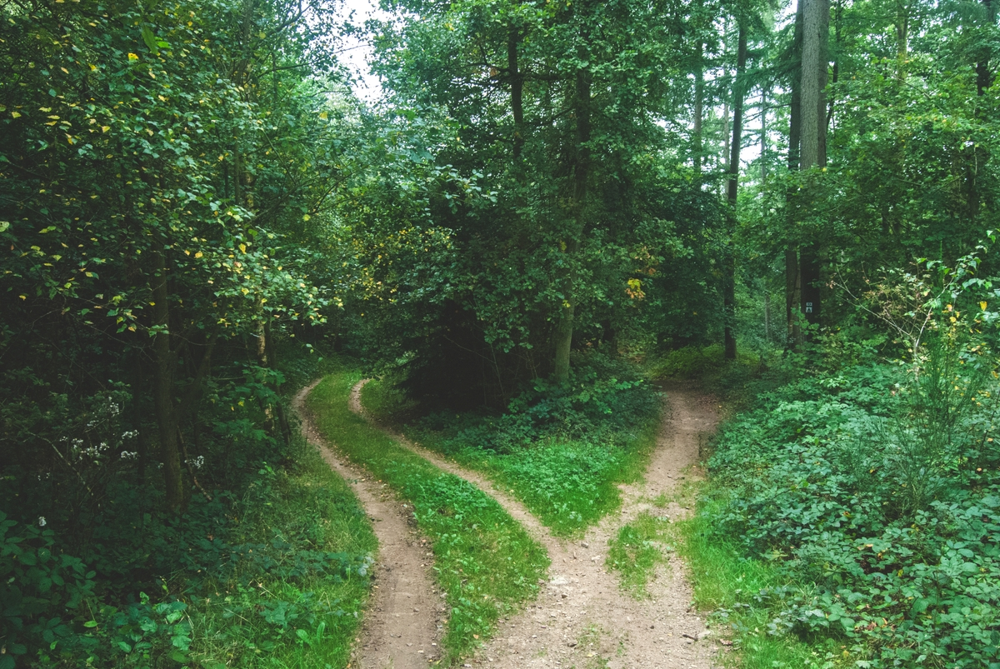

```{r,echo = FALSE, fig.alt="Petr Slováček on Unsplash", fig.align='center'}
#| out-width: "50%"
#| fig-cap: "Petr Slováček on Unsplash"

```

## Introduction

To be written up !!

Bruce Hornsby The Road Not Taken\
Robert Frost\
Scott Adams\


## References


## Additional Readings

1. The Story of Nachiketa ( Shreya and Preya ). <https://culturalsamvaad.com/story-of-nachiketa-and-yama-katha-upanishad-key-lessons/>

