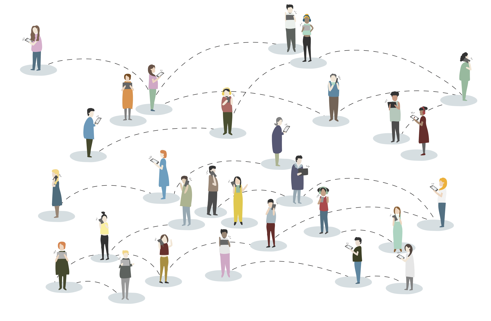

```{r,echo = FALSE,fig.alt="Petr Slováček on Unsplash", fig.align='center'}

```

## Introduction

Do you think your friends have more friends than you have? Do you think
that you are **outside the herd**, and that what you think or do is from
your own mind?

`Anyways`...

## Activities

### Activity-1: Secret Santa Game

Let us play this in the vanilla way: Paper chits with names in a bin and
drawing them in turn. What can go wrong with this? Ask [Avni
Gupta](https://www.linkedin.com/in/avni-gupta-551014267/).

Should we use this instead?<https://www.drawnames.com.sg/secret-santa-generator>

Discussion:
`Nodes, Links, Link Directionality, Connected and Disconnected Networks`

### Activity-2: Barabasi Cocktail Party Game

This is a game "invented" by Alberto-Laszlo Barabasi, a Network Science
pioneer and expert, who has written a wonderful, and wonderfully
acessible, book on Network Science, available online. <http://networksciencebook.com/>

1.  Please take a coin in your hand. (A rupee coin is good!)
2.  Find a ~~stranger~~ potential new friend in the classroom. Both of
    you toss your coins.
3.  If the coins show two Heads or two Tails, introduce yourselves, make
    small talk, exchange classroom and college gossip. 2 Minutes!
4.  Make a note of your new friends initials.
5.  We will plot this conversation on the board. How?

::: {}
<center>

Connect the Dots
</center>
:::

Discussion:
`Network Mechanisms, Information Flow, Giant Component, Emergence`

### Activity-3: Indian Surnames Game

1.  How many common Indian surnames do we know? Let us write them on the
    board.
2.  Each of us will now look at each surname and recollect how many
    people they know with that surname.
3.  Write down the score for each surname.
4.  Let's plot this on (yet another) network!!

Discussion:
`Node Degree, Giant Component?  Small Worlds?  Multi-Link network, Link Values or Costs`

### Activity-4: Hi, I am Kevin Bacon, SMI Foundation Batch

Let us find a Keven Bacon in SMI Foundation Studies Programme!! Six
Degrees of Separation...or of Kevin Bacon? Look at this video before you proceed!

::: {}
<center>

Six Degrees of Separation
</center>
:::

1.  Collect friends Data from across college/class, import and plot,
    analyze and comment
2.  Use this online tool at DataBasic.io <https://databasic.io>
    to *Connect the Dots*, OR
3.  Even more fun at at GraphCommons
    <https://graphcommons.com/graphs/new>

Discussion: `Node Degree, Centrality, Betweenness, Link Values or Costs`

### Activity-5: Can you introduce me to Chandler, again?

1.  Take your favourite Literary Work / TV Serial / Movie and create a
    Network Database for it.
1.  How? Use conversations between pairs of individuals (`nodes`) to
    create links. E.g. each distinct conversation is a `link`, and the
    number of sentences uttered is the `weight` of the link.
1.  Visualize it either with or without tech tools From Teach
    Engineering, this Activity Sheet
    <https://www.teachengineering.org/activities/view/uno_graphtheory_lesson01_activity2>.
        **Hah! Engineering in a Design college!!**`r emoji::emoji("rofl")`
1.  Can also use [Graph Comics](https://aviz.fr/~bbach/graphcomics/)<https://aviz.fr/~bbach/graphcomics/>

Discussion:
`Networks are everywhere, Cannot "unsee" them, You are a node and you are a link...are you?`

## References

1.  Albert-Laszlo Barabasi. *Network Science*.
    <http://networksciencebook.com>
2.  Dmitry Zinoniev, Network Science Intro Slides.
    <https://www.slideshare.net/DmitryZinoviev/workshop-20212296>
3.  The Network Effects Bible.
    <https://www.nfx.com/post/network-effects-bible>
4.  Mark Newman, *The Physics of Networks*. Good intro Power Laws and
    examples of many networks. [Read the
    PDF](../../../../materials/pdfs/newman-physics-of-networks.pdf)
    
5.  The Historical Network Research Community.
    <https://historicalnetworkresearch.org>
6.  Konrad M. Lawson, [*Toilers and Gangsters: Simple Network
    Visualization with R for
    Historians*](https://kmlawson.github.io/dh-tutorials/network.html)
7.  A Network oriented short story. Frigyes Karinthy, "Chains". [Read
    PDF](http://vadeker.net/articles/Karinthy-Chain-Links_1929.pdf)
8.  *Who told you about Srishti? Where?* Mark Granovetter, *The Strength
    of Weak Ties*,
    <https://www.cs.cmu.edu/~jure/pub/papers/granovetter73ties.pdf>
9.  Michele Coscia. 2019. *Who will Cluster the Cluster Makers?*
    <https://www.michelecoscia.com/?p=1709> Accessed 12 Jan 2024.
10. Ran Katzir. Nov 16, 2019. *Experience Network Science Through
    Play*.[https://medium.com/\@ran_katzir/teaching-network-science-using-board-games-f78489a3b3bd](https://medium.com/@ran_katzir/teaching-network-science-using-board-games-f78489a3b3bd){.uri}
11. Mark Hoffman, *Methods for Network Analysis.*
    <https://bookdown.org/markhoff/social_network_analysis/>
12. Omar Lizardo and Isaac Jilbert, *Social Networks: An Introduction.*
    <https://bookdown.org/omarlizardo/_main/>
13. David Easely and Kleinberg. Networks, Market and Crowds. **The Rich
    get Richer.**
    <http://www.cs.cornell.edu/home/kleinber/networks-book/networks-book-ch18.pdf>

::: {.content-hidden}
## Network Science in a Bollywood Song

Song: Kuchh Toh Log Kahenge\
Singer: Kishore Kumar\
Music: R. D. Burman\
Film: Amar Prem (1972)\

<u><https://www.youtube.com/watch?v=OK6Hux4spNM></u>

| Hindi Lyrics | English Translation |
|--------------------------------|----------------------------------------|
| Kuch toh log kahenge | People will say something or the other |
| Logon ka kaam hai kehna | It's the job of people to say something |
| Chhodo bekaar ki baaton mein | Forget all these useless things |
| Kahin beet na jaaye raina | Or else our night will end just around them |
| Kuch toh log kahenge | People will say something or the other |
| ------ | ------- |
| Kuch reet jagat ki aisi hai(2) | Some traditions of the world are such that |
| Har ek subah ki shaam huyi(2) | Every morning has had an evening |
| Tu kaun hai, tera naam hai kya | Who are you and what's your name |
| Sita bhi yahan badnaam huyi | Even Goddess Sita has been defamed here |
| Phir kyun sansaar ki baaton se | Then why with these conversations of the world |
| Bheeg gaye tere naina | Have your eyes become bedewed |
| Kuch toh log kahenge | People will say something or the other |
| ---------- | ------------ |
| Humko joh taane dete hai(2) | Those who taunt us saying that |
| Hum khoye hai in rangraliyon mein(2) | We're lost in this debauchery |
| Humne unko bhi chup chupke | Secretly I've also seen them |
| Aate dekha in galiyon mein | Coming in these streets |
| Yeh sach hai jhoothi baat nahi | This is the truth and not a lie |
| Tum bolo yeh sach hai na | You tell me, isn't this the truth? |
| Kuch toh log kahenge | People will say something or the other |
| ... | ... |

<br>

:::
