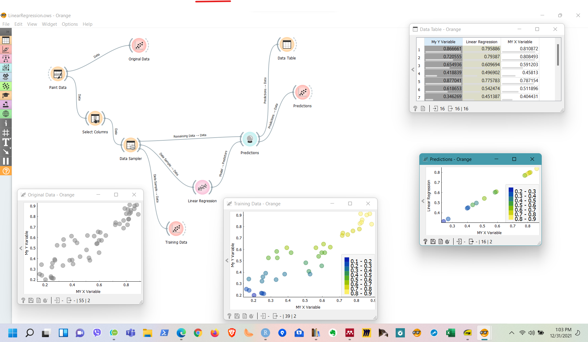

```{r include=FALSE}
library(blogdown)
library(tidyverse)
library(plotly)
library(reshape2)
library(plot3D)

```


### Introduction: Mixing Colours

Interpolation:   

 - between TWO colours, both colours inclusive using a straight line between them  
 - between several different colours?  
    - by mixing "equal proportions" of each  
    - Proportions based on "distance" from each colour  
    - On a "plane" with these points  


### Some Examples from Drama

1. Legally Blonde: 

::: {fig-legally-blonde}
<center>

</center>
Legally Blonde
:::


2. Greek Chorus Explained: 

::: {fig-greek-chorus}
<center>

</center>
The Greek Chorus Concept
:::


3. Sutradhar in Indian Drama



<https://www.britannica.com/art/theater-building/Developments-in-Asia#ref463835>

### Discussion

- Interpolation
- Extrapolation
- Calculating the *optimum * values for **m** and **c**, given **x and **y**, for $y = mx + c$

### Playing with Orange: Paint My Data

```{r}
#| label: fig-linear-regression
#| fig-cap: Painting Data for Regression
#| echo: false
#| out.height: "450px"
#| out.width: "450px"
#| fig-align: center
#| 


```

Let us "draw inspiration" from the picture above, and see if we can replicate it. We will fire up Orange, **paint some data** and see if we can fit a **linear regression ML model** to it. 

Here is the Orange file for you to download. Open [**this file**](LinearRegression.ows) in Orange. 


### Regression Plane

::: {.column-page-right}

```{r}
#| label: fig-regression-plane
#| fig-cap: Interactive Regression Planes
#| fig-subcap:
#|   - Cars and Mileage vs Weight + CC
#|   - Penguin Weight vs Flipper  + Bill
#| echo: false
#| 

## Cars Data
# x, y, z variables
x <- mtcars$wt
y <- mtcars$disp
z <- mtcars$mpg
# Compute the linear regression (z = ax + by + d)
fit <- lm(z ~ x + y)
# predict values on regular xy grid
grid.lines = 26
x.pred <- seq(min(x), max(x), length.out = grid.lines)
y.pred <- seq(min(y), max(y), length.out = grid.lines)
xy <- expand.grid( x = x.pred, y = y.pred)
z.pred <- matrix(predict(fit, newdata = xy), 
                 nrow = grid.lines, ncol = grid.lines)
##
# fitted points for droplines to surface
fitpoints <- predict(fit)
# scatter plot with regression plane
# scatter3D(x, y, z, pch = 18, cex = 2, 
#     theta = 20, phi = 20, ticktype = "detailed",
#     xlab = "wt", ylab = "disp", zlab = "mpg",  
#     surf = list(x = x.pred, y = y.pred, z = z.pred,  
#     facets = NA, fit = fitpoints), main = "mtcars")


plot_ly() %>% 
  add_markers(x = ~wt, y = ~ disp, z = ~ mpg, color = "orange", data = mtcars) %>% 
  add_surface(x = ~x.pred, y = ~y.pred, z = ~ z.pred, showlegend = FALSE) %>% 
  layout(
    scene = list(
      xaxis = list(title = "Car Weight"),
      yaxis = list(title = "Engine Displacement (cc)"),
      zaxis = list(title = "Miles per Gallon"),
      camera = list(
        eye = list(x = 1.25, y = 1.25, z = 1.25),
        center = list(x = 0, y = 0, z = 0),
        up = list(x = 0, y = 0, z = 1) )), 
  title = "Cars: Mileage predicted by Weight and Engine Displacement",
         autosize = TRUE,
         margin = list(l = 20, r = 20, b = 40, t = 40, pad = 40),
showlegend = FALSE) %>% 
  hide_legend()

## Penguins
my_df <- penguins %>% drop_na()
penguin_lm <- lm(body_mass_g ~ 0 + flipper_length_mm + bill_length_mm, data = my_df)
####
#Graph Resolution (more important for more complex shapes)
graph_reso <- 0.5

#Setup Axis
axis_x <- seq(min(my_df$flipper_length_mm), max(my_df$flipper_length_mm), by = graph_reso)
axis_y <- seq(min(my_df$bill_length_mm), max(my_df$bill_length_mm), by = graph_reso)

#Sample points
penguin_lm_surface <- expand.grid(flipper_length_mm = axis_x, bill_length_mm = axis_y,KEEP.OUT.ATTRS = F)
penguin_lm_surface$body_mass_g <- predict.lm(penguin_lm, newdata = penguin_lm_surface)
penguin_lm_surface <- reshape2::acast(penguin_lm_surface, bill_length_mm ~ flipper_length_mm, value.var = "body_mass_g") #y ~ x
#####
hcolors=c("red","blue","green")[my_df$species]

plot_ly() %>% 
  add_markers(data = my_df, 
                     x = ~flipper_length_mm, 
                     y = ~bill_length_mm, 
                     z = ~body_mass_g,
                     text = ~species, # EDIT: ~ added
                     marker = list(color = hcolors)) %>% 

  add_surface(z = ~penguin_lm_surface, x = ~axis_x,
                       y = ~axis_y,
                       type = "surface") %>%
  layout(
    scene = list(
      xaxis = list(title = "Flipper Length"),
      yaxis = list(title = "Bill Length"),
      zaxis = list(title = "Body Weight"),
      camera = list(
           eye = list(x = 1.25, y = 1.25, z = 1.25),
           center = list(x = 0, y = 0, z = 0),
           up = list(x = 0, y = 0, z = 1))),
    title = "Penguins: Body Mass predicted by Flipper Length and Bill Length",
    autosize = TRUE,
    margin = list(l = 20, r = 20, b = 40, t = 40, pad = 40)) %>% 
  plotly::hide_legend()

```
:::


## Data Sets


## Interpreting Regression


## Predicting with Regression


## Wait, But Why?


## Refernces


