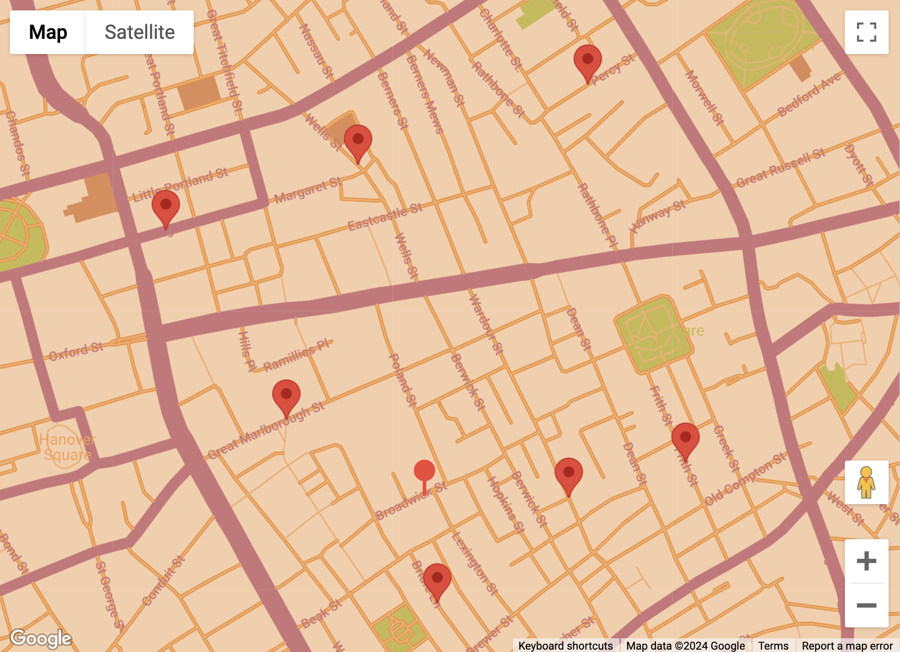

```{r echo=FALSE,message=FALSE}
knitr::opts_chunk$set(echo = TRUE)
library(blogdown)
library(emoji)
#devtools::install_github("mccarthy-m-g/embedr")
library(embedr) # Embed multimedia in HTML files
library(htmlwidgets)
library(slickR)
library(bsplus)
```

```{r}
#| label: fig-soho-map
#| echo: FALSE
#| out.width: "580px"
#| out.height: "480px"
#| fig.align: 'center'
#| fig-cap: "Map of Soho, London"

```


## Introduction

### Meeting Kandinsky

Have you heard of a painter called Wassily Kandinksy?

```{r, echo=FALSE, out.width = "300px", out.height = "360px", fig.align='center'}
knitr::include_graphics("https://upload.wikimedia.org/wikipedia/commons/8/8a/Vassily-Kandinsky.jpeg")
```

Extract from <https://artsandculture.google.com/story/QgUxxeY10_VADg>

> 1.  **He had the gift of synesthesia.** Kandinsky was capable of
>     synesthesia, an involuntary neurological phenomenon by which a
>     person perceives several senses as being associated. In
>     Kandinsky's case, the sense of hearing was associated with the
>     sense of sight, sounds, and colors being intimately linked in his
>     mind. He could therefore " see music " as he found himself
>     following a performance of Wagner's *Lohengrin*.

> 2.  **He became an artist at the age of 30.** In December 1896,
>     Kandinsky left his homeland and moved to Munich with his wife,
>     Ania Tchimiakina, in order to start a career as an artist. It was
>     a radical move, a true departure. The artist was already 30-years
>     old and left behind a respectable life, conforming to the
>     conventions dictated by his family lineage.

> 3.  **He opened his own school in 1902: it was open to women.** At the
>     beginning of 1902, the Phalanx (group and school opposed to
>     conventional and conservative art viewpoints) of which Kandinsky
>     was president, opened a painting school in Schwabing. Kandinsky
>     taught painting and drawing there. The school was open to women
>     from its inception. This position was non-conformist and
>     progressive, since, at the time, women were only admitted to the
>     Society of Women Artists, an institution linked to the Munich
>     Academy of Fine Arts, or to the evening classes of that Academy.

> 4.  **He was friends with Marcel Duchamp.** European avant-garde made
>     its official entry into the United States in 1913 at the Armory
>     Show in New York. Kandinsky exhibited Improvisation 27, which
>     artist and gallery owner Alfred Stieglitz bought to defend him
>     against criticism. Marcel Duchamp's Nude Descending a Staircase
>     was a scandalous success. Another scandal followed in 1917 when
>     Duchamp presented a urinal claiming artwork status to the hanging
>     committee of the Salon of independent artists of which he is a
>     member: Fountain became history, formalizing the invention of the
>     ready-made, a radical innovation which establishes an art of the
>     idea and positions Duchamp in art history.

> 5.  **He was a member of the " Blue Four" group** The German Galka
>     Scheyer, who emigrated to New York in 1924, was the founder of the
>     Blue Four group. After successful avant-garde exhibitions, he
>     founded the influential Munich group Der Blaue Reiter (“The Blue
>     Rider”; 1911–14) and began completely abstract painting. His forms
>     evolved from fluid and organic to geometric and, finally, to
>     pictographic (e.g., Tempered Élan, 1944).

Here is a link to his [**Top 40
Paintings.**](https://www.wassilykandinsky.net/painting1896-1944.php)

Let us listen to Mathew Ritchie tell us about Kandinsky.

::: {}
<center>

Mathew Ritchie on Kandinsky
</center>
:::

### The Math in Kandinsky

Here is a brief paper discussing the **Math-Art of Wassily
Kandinsky.**:

:::{}
<center>

Karl Katchee.*Kandinsky, Math Artist?*
</center>
:::
<br>
What are the Key Insights from this paper?

-   A very spatial aspect to his paintings?
-   Metaphoric Correspondence between Emotions and Colours/Shapes
-   Do we use Similar Language?
-   Geometry pervades our lives
-   Proximity can be interpreted in many ways

## Using Proximity as a Model

Can we use Proximity as a measure to quantify our experiences? What sort
of experiences? What emotions could be involved? How can we attach
*numerical significance* to those emotions?

### Walking the Streets in Soho

Are you thirsty? Would you like some water?

::: {}
<center>

Cholera in Soho
<br>
</center>
:::
More here: <https://www.wikiwand.com/en/1854_Broad_Street_cholera_outbreak>

### A Proximity Effect

Let us play this **Vaccination Game**: <https://www.complexity-explorables.org/explorables/i-herd-you/>

::: {}
<center>

Epidemonic: A Complexity Explorable
</center>
:::


### Fun Stuff with Kandinsky

Let's also become synesthetic, however temporarily, and make music with
Kandinsky !!

Chrome Music Lab : Kandinsky: This experiment is inspired by Wassily
Kandinsky, an artist who compared painting to making music. It turns anything you draw – lines, circles, triangles, or scribbles – into
sound. <https://musiclab.chromeexperiments.com/kandinsky/>

::: {}
<center>

Kandinsky Music Generator
</center>
:::

### How to say, "You are standing too close to me?"

Can we ask Sting? <https://youtu.be/KNIZofPB8ZM>

Maybe not. There are better Models, may be!!

## References

1.  Dirk Brockman: [This message must be Herd -
    PDF](../../../../materials/pdfs/Brockman-ThisMessageMustBeHerd.pdf)
1.  P. Bingham, N.Q. Verlander, M.J. Cheal (2004). *John Snow, William
    Farr and the 1849 outbreak of cholera that affected London: a
    reworking of the data highlights the importance of the water
    supply*. Public Health Volume 118, Issue 6, September 2004, Pages
    387-394. [Read the
    PDF.](https://sci-hub.se/https://doi.org/10.1016/j.puhe.2004.05.007)
1. `{{ggvoronoi}}` package in R: <https://github.com/garretrc/ggvoronoi>
1.  Make quick cool maps with [Snazzy Maps.](https://snazzymaps.com)

