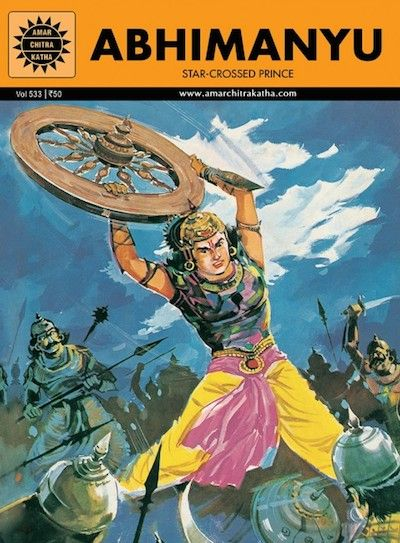

<br>

```{r}
#| echo: false
#| fig-align: center
#| out-width: "50%"
#| out-height: "50%"
#| 



```

## Introduction

Why did Abhimanyu have to fight alone, to the death? Why could not any one from the Pandava Army help him??

What are the *finger movements and gestures* we use to operate our hand-held screens?

But why are these two questions here, side-by-side?? 

## Two Cultural Memories

Let us consider two very widely "separated" cultural ideas: the Chakrayuha from the Mahabharata, and the poem *My Garden* by T.E. Brown. Both are about symmetry, but in very different ways. And then we might *Count the Ways* they are different, using Elizabeth Barrett Browning's famous sonnet titled (TBD)(Sonnets from the Portuguese).

###### The Chakravyuha from the Mahabharata

In the Mahabharata, there is the story of Abhimanyu, the son of Subhadra and Arjuna, who learnt (when in his mother's womb) about how to penetrate a military battle formation called the *Chakravyuha* or *Padmavyuha*:

>The Padmavyūha is a multi-tiered defensive formation that looks like a blooming lotus (पद्म padma) or disc (चक्र chakra) when **viewed from above**[^1].The warriors at each interleaving position would be in an increasingly tough position to fight against. The formation was used in the battle of Kurukshetra by Dronacharya.

The formation has rotational symmetry (spinning chakra) and layered, **self-similar structure**. From afar or in motion, it may appear *uniform* or *disorienting*  - hard to assign a fixed "direction" or path. Mirroring or rotating the view would preserve its threatening appearance.

###### My Garden by Thomas Brown

T.E. Brown’s short poem *My Garden* (often called “A Garden is a Lovesome Thing, God Wot!”) celebrates the garden as an ordered, harmonious space infused with divine presence:

> A garden is a lovesome thing, God wot!  
> Rose plot,  
> Fringed pool,  
> Ferned grot—  
> The veriest school  
> Of peace; and yet the fool  
> Contends that God is not—  
> Not God! in gardens! when the eve is cool?  
> Nay, but I have a sign;  
> ’Tis very sure God walks in mine.

The poem portrays the garden as a microcosm of beauty, peace, and symmetry: neatly plotted roses, a bordered pool, a fern-filled grotto — structured, balanced, and inviting. This human-imposed (or cultivated) order becomes a “school of peace” and evidence of the divine.

## Discussion-1

- The **Chakravyuha** is a **dynamic, martial symmetry**: a rotating, multi-layered lotus/wheel formation of warriors with concentric rings, synchronized movement, and strategic balance. 
- Its symmetry serves entrapment and defense — ordered, patterned, and cyclic, yet labyrinthine and *disorienting* to outsiders. 
- The Chakravyuha deploys **rotational** and **hierarchical** symmetry for strategic dominance and psychological dominance.
- Like the garden, it represents imposed human order and beauty (from the commander’s *aerial view*, a perfect chakra/lotus), but from the intruder’s *perspective*, it is a trap of deceptive harmony. 
- Brown’s garden uses **static, nurturing symmetry** (plots, fringes, balance) to create peace and to reveal God to the poet. 

In both, ***symmetry is not accidental*** — it is *designed*. 

## Discussion-2

- Did you get a sense of a varying "Point of View" in the two examples? Which words suggested a varying stance on part of the viewer (you) ?
- Can a Chakravyuha be *uniform* and *disorienting* at the same time? How does it achieve this duality?
- What does *disorienting* mean?
- How can a Chakravyuha ***move*** and still be orderly?
- How does the static garden both inspire and potentially stultify?


### Wait, But Why?

We *crave* symmetry because it signals order, predictability, health, and beauty. Formal gardens, classical architecture, balanced faces, symmetrical logos, and even Chakravyuha-like mandalas appeal to us. It reduces cognitive load (easier to process) and evokes harmony.

Yet we complain about it too:

- **Over-symmetry feels sterile or oppressive**: Perfectly manicured lawns or identical suburban houses can seem soulless or monotonous (“cookie-cutter”). Brown’s garden has structured plots but implies organic life within (roses blooming, evening coolness).
- **Labyrinthine or rigid symmetry traps us**: The Chakravyuha’s ordered beauty becomes a prison. In life, we resent “the daily grind,” bureaucratic routines, or overly rigid social norms — symmetric but stifling.
- **We romanticize asymmetry**: Wild nature, creative chaos, wabi-sabi imperfection, or organic gardens often feel more alive. The poem’s “fool” misses the divine precisely because they overlook the lived, personal symmetry of *my* garden.

This ambivalence is deeply human. We impose symmetry for control and meaning (gardens, battle plans, and....in ML models seeking isotropic residuals!!), then rebel when it becomes too perfect or confining. It mirrors the tension between order and chaos, [Apollo and Dionysus](https://gregorybsadler.substack.com/p/nietzsches-birth-of-tragedy-apollo).

### Do We Have a “Gene” for Symmetry?

Not a single “symmetry gene,” but **yes, there is a strong evolved biological and psychological basis** for preferring symmetry. Evolutionary psychology and biology link it to **developmental stability** and **genetic quality**:

- Bilateral symmetry in faces and bodies signals resistance to environmental stressors, parasites, mutations, and disease during development. More symmetric individuals were (on average) healthier mates in ancestral environments.
- This preference is cross-cultural and appears early in infants. It extends beyond faces to objects, patterns, and environments.
- Neuroscience shows symmetry detection is hard-wired in our visual system — rapid and automatic.

It’s not purely genetic determinism (culture, experience, and context modulate it), but an innate bias shaped by evolution, reinforced by learning. We like symmetry in mates, art, and design because our ancestors who did so had reproductive advantages. Yet our complaints arise from higher cognition: we also value novelty, creativity, and narrative complexity that perfect symmetry can suppress.

We will next get into the uh, *maths* of symmetry and see where that fits into Art and Design! 

And add *randomness* to the mix?

## References

1. Anagram Algebra. <https://matthematics.com/redoak/sec_anagrammer.html>
1. 

## Additional Material to be Cleaned Up!!

In tying it together: The Chakravyuha and Brown’s garden both tap this “symmetry drive.” We build them seeking order and transcendence, yet the very symmetry that attracts us can also entrap or bore us. True wisdom (or divine presence) may lie in *balanced* symmetry — structured enough for peace and navigation, but alive with enough asymmetry for growth and escape. 

This ambivalence enriches both the poem and the epic: gardens and chakras are human impositions of pattern on the universe, revealing as much about our inner wiring as about the world itself. What aspect of this resonance interests you most for further exploration?

Mahabharata\
T. E. Brown\


### Anagrams

**Anagrams link to symmetry in science primarily through mathematics—specifically permutations, group theory, and combinatorics—which underpin symmetry concepts across physics, chemistry, and biology.**

### 1. Anagrams as Permutations (The Fundamental Math Link)
An anagram rearranges the letters of a word or phrase. This is exactly a **permutation**—a reordering of a finite set of elements (letters).

- The set of all possible rearrangements of *n* distinct letters forms the **symmetric group** Sₙ (the group of all permutations of n objects).
- Group theory is the mathematical language of **symmetry**. A symmetry of an object is a transformation (rotation, reflection, etc.) that leaves it looking unchanged. These transformations form a **symmetry group**.

**Example**: For the word "ABC" (3 distinct letters), there are 3! = 6 permutations (anagrams, including itself): ABC, ACB, BAC, BCA, CAB, CBA. These form the symmetric group S₃, which is also the symmetry group of an equilateral triangle (rotations and reflections).

This connection is taught in some algebra contexts as "anagram algebra," where generating anagrams illustrates group operations (composition of permutations, inverses, identity).

### 2. Symmetry in Science and How Anagrams/ Permutations Relate
Symmetry in science means invariance under transformations. Permutation ideas from anagrams help model or analyze this:

- **Chemistry & Crystallography (Molecular/Point Group Symmetry)**: Molecules are classified by symmetry groups (point groups like C₂ᵥ, D₆ₕ). These groups consist of symmetry operations (rotations, reflections, inversions) that map atoms to equivalent positions—essentially permuting the atoms while leaving the molecule "the same."
  - Tools like character tables (from group theory) predict properties such as vibrational modes, IR/Raman activity, or orbital symmetries.
  - Analogy: Just as not every letter rearrangement makes a meaningful word (only specific permutations "work"), only certain permutations of atomic positions preserve molecular symmetry.

- **Physics (Noether's Theorem and Fundamental Symmetries)**: Continuous symmetries (e.g., rotational symmetry in space) correspond to conserved quantities (angular momentum). Discrete symmetries and permutation symmetries appear in particle physics (e.g., identical particle statistics for bosons/fermions rely on permutation symmetry of wavefunctions).

- **Biology**: Bilateral symmetry in organisms (left-right mirror images) or radial symmetry can be thought of in terms of invariant transformations. Evolutionary or developmental biology sometimes uses symmetry-breaking concepts, where small perturbations break perfect symmetry.

- **Special Cases with Visual/Linguistic Symmetry**:
  - **Palindromes**: A subset of anagrams with **reflection symmetry** (reads the same forwards and backwards, like "radar"). These illustrate one-dimensional mirror symmetry.
  - **Ambigram**: Words designed to look the same under rotation or reflection—graphic symmetry combining anagram-like letter play with visual invariance.
  - **Star anagrams**: Advanced rearrangements with geometric symmetry properties in how letters connect when drawn as polygons.

### 3. Practical Ways to Explore/Link Them
- **Educational Activity**: Take a molecule like water (H₂O, bent, C₂ᵥ symmetry). Label atoms and explore permutations that preserve the structure (e.g., swapping the two H atoms). This mirrors finding valid "symmetric anagrams."
- **Programming/Math Tools**: Use Python (itertools.permutations for anagrams) or group theory software (GAP, SageMath) to generate permutations and compare to symmetry groups.
- **Teaching Aid**: Use anagrams to introduce abstract algebra before diving into physical symmetries—students rearrange letters, then map that to rotating a symmetric object.

In short, anagrams provide an accessible, everyday example of **permutations**, which are the building blocks of the abstract groups that rigorously describe symmetry in nature and science. This bridge is strongest in math education and chemistry (via group theory applications), rather than a direct "anagrams explain physics" link. It's a great way to make symmetry less abstract! 

If you want examples in a specific field (e.g., quantum chemistry) or activities/code to demonstrate this, let me know.

## Group Theory and Network Science

**Group theory connects naturally to network science** (including Barabási’s work) through the study of **network symmetries**, described by **automorphism groups**. This builds on the permutation/group theory ideas from anagrams while applying them to the structure and dynamics of complex networks like those illustrated in the "Cocktail Party" game.

### Quick Recap: The Barabási Cocktail Party Game/Context
In Barabási’s lectures and book, the cocktail party serves as an interactive model for network formation:

- People (nodes) arrive and form connections (edges) based on rules like preferential attachment ("rich-get-richer": connect to popular people) or random linking.
- It demonstrates emergence of **scale-free networks**, small-world properties, clustering, and hubs—key features in social, biological, and technological networks.

This is a hands-on way to explore the Barabási–Albert (BA) model and related dynamics.

### Linking Group Theory: Network Automorphisms as Symmetries
A **network automorphism** is a permutation (rearrangement) of the nodes that preserves the edge structure—i.e., the network looks identical after the relabeling. The set of all such automorphisms forms the **automorphism group** of the graph, a subgroup of the full symmetric group Sₙ (where n is the number of nodes).

This directly parallels:
- **Anagrams**: Permutations of letters that may (or may not) form valid words.
- **Molecular symmetry**: Permutations of atoms that leave the molecule invariant (point groups in chemistry).

**In network science**:
- **Symmetry quantification**: Real-world networks often have rich but imperfect symmetries. Highly symmetric networks (large automorphism groups) behave differently in terms of robustness, synchronization, controllability, and information flow.
- **Emergence of symmetry**: Models like the BA preferential attachment can be modified to reproduce observed symmetries in real networks. Pure random or preferential models tend to produce asymmetric graphs, but adding "similar linkage patterns" or other rules leads to more symmetric structures.
- **Decomposition and orbits**: The automorphism group partitions nodes into **orbits** (sets of equivalent nodes under symmetry). Hubs or peripheral nodes may belong to different orbits, affecting dynamics (e.g., which nodes are better for spreading information or controlling the network).

### Applications to Games/Models Like the Cocktail Party
1. **Analyzing the Emergent Network**:
   - After the party game, compute (or approximate) the automorphism group of the resulting graph.
   - Use tools like **nauty**, **SageMath**, or **NetworkX** (Python) with graph automorphism functions.
   - Question for participants: "Which people are 'symmetric'—indistinguishable by connections?" This reveals roles (e.g., equivalent isolates vs. equivalent hubs).

2. **Symmetry-Breaking and Dynamics**:
   - Group theory helps study how symmetries break or emerge over time (e.g., as new guests arrive and preferential attachment kicks in).
   - In synchronization or epidemic models on networks, symmetric substructures (orbits) often synchronize together.

3. **Broader Network Science Ties**:
   - **Graph isomorphism and equivalence**: Group actions classify networks up to symmetry.
   - **Spectral graph theory**: Eigenvalues of the adjacency/Laplacian matrix relate to symmetries (degenerate eigenvalues often indicate symmetry).
   - **Control and robustness**: Symmetries impose constraints on controllability (some symmetric nodes are harder to control independently).
   - In Barabási’s framework: Hierarchical organization, motifs, and community structure can be refined using symmetry group decompositions.

### Practical Ways to Teach/Link This
- **Activity Extension**: Run the cocktail party game → build the adjacency list → use code to find automorphisms and orbits. Discuss how symmetry affects "influence" or "fairness" in the party network.
- **Math Bridge**: Start with small examples (cycle graph Cₙ has dihedral group symmetry Dₙ; complete graph Kₙ has full Sₙ). Scale up to random/scale-free graphs, which typically have trivial (small) automorphism groups unless engineered for symmetry.
- **Research Angle**: Explore papers on "Symmetry in Complex Networks" (e.g., MacArthur et al.) that explicitly tie automorphism groups to topology and function in systems Barabási studies.

This creates a nice progression: **Anagrams (permutations) → Group Theory (abstract symmetry) → Network Automorphisms (applied to real-world graphs and games)**. It shows how the same mathematical tools unify linguistics, chemistry, and network science.

If you want code examples (e.g., Python with NetworkX for a small party graph), specific paper summaries, or ways to tie this to a particular aspect of your discussions, provide more details!


[1]:<https://archive.org/details/indiathroughages00mada>
