```{r}
#| label: setup
#| echo: false
#| message: false
#| warning: false
#| 
library(blogdown)
library(tidyverse)
library(igraph)
library(ggraph)
library(tidygraph)
library(gganimate)
library(ggplot2)
library(gifski)


```


## Introduction

Here, we will see a few Network Behaviours and Network Effects, and understand how they could be useful tools in Art and Design!

### Erdos and Renyi: Random Networks

Consider a set of nodes. Edges can appear randomly between any pair of nodes. Sounds familiar? This is exactly the Barabasi Cocktail Party Game we played [earlier](../40-Networks/index.qmd#activity-2-barabasi cocktail-party-game). 

In many ways this is the *most agnostic*, or ***Null*** model that network scientists use, a network where there are no causes for connection except random ones. By this logic, anything that is **not random**, or even **differently random** would have some phenomenon lurking underneath! ( Apropos: A NULL Model is often used in Statistics. More here, on [yet another website of mine](https://madhatterguide.netlify.app/content/courses/analytics/20-inference/modules/100-onemean/#statistical-inference-is-almost-an-attitude) ). 

::: {.content-hidden}
There are two closely related formulations, often denoted `G(n, p)` and `G(n, m)`:

::: {.grid}
::: {.g-col-6}
`G(n, p)` **(most common)**:

- Start with n nodes (vertices).
- For every possible pair of distinct nodes, add an edge independently with probability p (0 < p < 1).
- Expected number of edges: $m ~\sim p × n(n-1)/2$.

```{r}
#| label: random-graph-gnp
#| echo: false
#| eval: false

# ============================================================
# Animated construction of an Erdos-Renyi random graph G(n, p)
#   n = 12 nodes
#   p = 0.05 (edge probability)
#
# The animation shows nodes fixed in a circular layout while edges
# are added one at a time (in random order), with the most recently
# added edge briefly highlighted before settling into the final graph.
#
# Requires: igraph, ggplot2, gganimate, dplyr, gifski
#   install.packages(c("igraph", "ggplot2", "gganimate", "dplyr", "gifski"))
# ============================================================

set.seed(2026)

# ---------------------------
# Parameters
# ---------------------------
n <- 12
p <- 0.05

# ---------------------------
# Generate the G(n,p) graph
# (p = 0.05 with n = 12 is sparse -- expected edges ~ p * choose(n,2) = 3.3,
#  so we guard against a degenerate all-isolated draw and re-roll if needed)
# ---------------------------
g <- sample_gnp(n, p, directed = FALSE, loops = FALSE)
while (ecount(g) == 0) {
  g <- sample_gnp(n, p, directed = FALSE, loops = FALSE)
}

# ---------------------------
# Fixed node layout (circle, so nodes never move -- only edges appear)
# ---------------------------
coords <- layout_in_circle(g)
node_df <- data.frame(id = 1:n, x = coords[, 1], y = coords[, 2])

# ---------------------------
# Edge list, shuffled into a random "arrival order"
# ---------------------------
edge_list <- igraph::as_data_frame(g, what = "edges")
edge_list <- edge_list[sample(nrow(edge_list)), ]
edge_list$arrival_order <- seq_len(nrow(edge_list))

edge_df <- edge_list %>%
  mutate(
    x    = node_df$x[from],
    y    = node_df$y[from],
    xend = node_df$x[to],
    yend = node_df$y[to]
  )

n_edges <- nrow(edge_df)
hold_frames  <- 10                     # extra frames to pause on the finished graph
total_frames <- n_edges + hold_frames

# ---------------------------
# Expand into one row per (edge, frame) for cumulative reveal:
# an edge appears from its arrival frame onward, and is tagged "new"
# only in the exact frame it arrives (for a brief highlight).
# ---------------------------
edge_frames <- lapply(0:total_frames, function(f) {
  edge_df %>%
    filter(arrival_order <= f) %>%
    mutate(frame = f,
           status = if_else(arrival_order == f, "new", "existing"))
})
edge_frames <- bind_rows(edge_frames)

node_frames <- lapply(0:total_frames, function(f) {
  node_df %>% mutate(frame = f)
})
node_frames <- bind_rows(node_frames)

# ---------------------------
# Build the animated plot
# ---------------------------
anim <- ggplot() +
  geom_segment(
    data = edge_frames,
    aes(x = x, y = y, xend = xend, yend = yend,
        color = status, linewidth = status)
  ) +
  geom_point(data = node_frames, aes(x = x, y = y), size = 10, color = "steelblue") +
  geom_text(data = node_frames, aes(x = x, y = y, label = id),
            color = "white", fontface = "bold", size = 4) +
  scale_color_manual(values = c(new = "firebrick2", existing = "gray55"), guide = "none") +
  scale_linewidth_manual(values = c(new = 1.6, existing = 0.9), guide = "none") +
  coord_equal(clip = "off") +
  theme_void() +
  labs(
    title    = "G(n, p) Random Graph Construction",
    subtitle = paste0("n = ", n, ",  p = ", p, "   |   Frame: {frame} / ", total_frames)
  ) +
  theme(
    plot.title    = element_text(hjust = 0.5, size = 16, face = "bold"),
    plot.subtitle = element_text(hjust = 0.5, size = 11)
  ) +
  transition_manual(frame)

# ---------------------------
# Render and save
# ---------------------------
animated <- animate(
  anim,
  nframes = total_frames + 1,
  fps     = 3,
  width   = 600,
  height  = 600,
  renderer = gifski_renderer()
)

anim_save("./images/gnp_random_graph_animation.gif", animated)

cat("Animation saved as: gnp_random_graph_animation.gif\n")
cat("Total edges in final graph:", n_edges, "out of", choose(n, 2), "possible pairs\n")


```

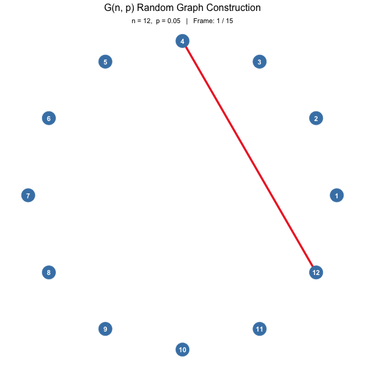

:::
::: {.g-col-6}
`G(n, m)`: 

- Start with n nodes.
- Choose exactly m edges uniformly at random from all possible pairs (no multiples or self-loops in the basic version).

```{r}
#| label: random-graph-gnm
#| echo: false
#| eval: false

# ============================================================
# Animated construction of an Erdos-Renyi random graph G(n, m)
#   n = 12 nodes
#   m = 4  (exact number of edges, placed uniformly at random)
#
# The animation shows nodes fixed in a circular layout while edges
# are added one at a time (in random order), with the most recently
# added edge briefly highlighted before settling into the final graph.
#
# Requires: igraph, ggplot2, gganimate, dplyr, gifski
#   install.packages(c("igraph", "ggplot2", "gganimate", "dplyr", "gifski"))
# ============================================================

set.seed(2026)

# ---------------------------
# Parameters
# ---------------------------
n <- 12
m <- 4

# ---------------------------
# Generate the G(n,m) graph
# (exactly m edges are placed uniformly at random among all possible
#  pairs of the n nodes -- unlike G(n,p), the edge count is guaranteed,
#  so no re-roll guard is needed)
# ---------------------------
g <- sample_gnm(n, m, directed = FALSE, loops = FALSE)

# ---------------------------
# Fixed node layout (circle, so nodes never move -- only edges appear)
# ---------------------------
coords <- layout_in_circle(g)
node_df <- data.frame(id = 1:n, x = coords[, 1], y = coords[, 2])

# ---------------------------
# Edge list, shuffled into a random "arrival order"
# ---------------------------
edge_list <- igraph::as_data_frame(g, what = "edges")
edge_list <- edge_list[sample(nrow(edge_list)), ]
edge_list$arrival_order <- seq_len(nrow(edge_list))

edge_df <- edge_list %>%
  mutate(
    x    = node_df$x[from],
    y    = node_df$y[from],
    xend = node_df$x[to],
    yend = node_df$y[to]
  )

n_edges <- nrow(edge_df)
hold_frames  <- 10                     # extra frames to pause on the finished graph
total_frames <- n_edges + hold_frames

# ---------------------------
# Expand into one row per (edge, frame) for cumulative reveal:
# an edge appears from its arrival frame onward, and is tagged "new"
# only in the exact frame it arrives (for a brief highlight).
# ---------------------------
edge_frames <- lapply(0:total_frames, function(f) {
  edge_df %>%
    filter(arrival_order <= f) %>%
    mutate(frame = f,
           status = if_else(arrival_order == f, "new", "existing"))
})
edge_frames <- bind_rows(edge_frames)

node_frames <- lapply(0:total_frames, function(f) {
  node_df %>% mutate(frame = f)
})
node_frames <- bind_rows(node_frames)

# ---------------------------
# Build the animated plot
# ---------------------------
anim <- ggplot() +
  geom_segment(
    data = edge_frames,
    aes(x = x, y = y, xend = xend, yend = yend,
        color = status, linewidth = status)
  ) +
  geom_point(data = node_frames, aes(x = x, y = y), size = 10, color = "steelblue") +
  geom_text(data = node_frames, aes(x = x, y = y, label = id),
            color = "white", fontface = "bold", size = 4) +
  scale_color_manual(values = c(new = "firebrick2", existing = "gray55"), guide = "none") +
  scale_linewidth_manual(values = c(new = 1.6, existing = 0.9), guide = "none") +
  coord_equal(clip = "off") +
  theme_void() +
  labs(
    title    = "G(n, m) Random Graph Construction",
    subtitle = paste0("n = ", n, ",  m = ", m, "   |   Frame: {frame} / ", total_frames)
  ) +
  theme(
    plot.title    = element_text(hjust = 0.5, size = 16, face = "bold"),
    plot.subtitle = element_text(hjust = 0.5, size = 11)
  ) +
  transition_manual(frame)

# ---------------------------
# Render and save
# ---------------------------
animated <- animate(
  anim,
  nframes = total_frames + 1,
  fps     = 3,
  width   = 600,
  height  = 600,
  renderer = gifski_renderer()
)

anim_save("./images/gnm_random_graph_animation.gif", animated)

cat("Animation saved as: gnm_random_graph_animation.gif\n")
cat("Total edges in final graph:", n_edges, "out of", choose(n, 2), "possible pairs\n")

```
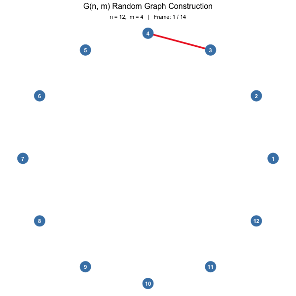

:::

:::

Both produce similar behavior for large n when m is chosen to match the expected edges in `G(n, p)`.

:::


###### Implications:

- **Degree Distribution**: With random attachment, we get a "bell-curve" like situation, where seemingly *nothing is happening. Most nodes have degrees close to the average; extremes are rare. There are not too many differences between nodes/people/agents. No one has a terrific viral network. 

::: {.callout-note}
#### Math Aside
(In `G(n, p)`, the degree of a node follows a `Binomial(n-1, p) distribution`. For sparse networks (p small, average degree $λ = p(n-1)$ fixed as n → ∞), this approximates a `Poisson(λ) distribution`. (More later when we meet [Hamlet.](../100-Randomness/index.qmd)) 

:::

- **Connectivity & Giant Component**: There is a critical threshold for connectivity.:
  - When average degree λ < 1: Many small components.
  - At λ ≈ 1: Phase transition — a giant component emerges.
  - λ > 1: Almost surely a single giant component containing most nodes.
Suddenly, if everyone has on average one friend, it is a connected world. On average!!!
- **Shortest Paths**: Small diameter and average path length (logarithmic in n for connected regimes) — the “small world” property appears even in this simple model.
- **Clustering**: No community structure, correlations, or growth dynamics.
- **No Hubs**: Lacks the heavy-tailed degree distributions (hubs) seen in scale-free networks.

###### Why it matters in Art/Design?

 - Good baseline to compare your Design ( assuming it is a network oriented thing )  to a random network. If your design is not better than random, there are improvements to be made!)
 - The emergent `Giant Component` is a metaphor for market uptake of a product. It represents a point of inflexion, or a tipping point. 
 - What can you do to create more correlated actions between nodes on a network? Then you have a better chance of *growth dynamics* setting in! (See below)
 
::: {.content-hidden}
###### Why is this important

- Null Model: Used to test whether properties in real networks (e.g., high clustering, assortativity, robustness) are statistically significant or just random.
- Mathematical Tractability: Many properties (component sizes, diameter, connectivity thresholds) can be derived analytically using probability theory.
- Historical Role: Introduced by Paul Erdős and Alfréd Rényi in the late 1950s/early 1960s. It marked the beginning of systematic random graph theory.

###### Limitations (Compared to Real Networks)

- Homogeneous degrees (Poisson-like) vs. heterogeneous (power-law) in many real systems.
- Low clustering.No community structure, correlations, or growth dynamics.

###### Comparison to Other Models

- Configuration Model: Fixes an arbitrary degree sequence (can be heavy-tailed) while randomizing connections. Better for matching real degree distributions.
- Barabási–Albert: Adds growth + preferential attachment to produce scale-free (power-law) degrees and hubs.
- Watts–Strogatz: Starts from a lattice and rewires to add small-world properties with high clustering.

Grok says: 
In your teaching context, the ER model pairs nicely with your Secret Santa or Barabási Cocktail Party games as a simple baseline: “What if connections were purely random with probability $p$?”
Simple Classroom Demo Idea: For small n, have students flip coins (or use random numbers) to decide edges and plot the resulting graph. Compare degree histograms to your surname or friendship activities.
It remains a cornerstone for understanding phase transitions and baseline randomness in networks. If you’d like formulas, code examples, phase transition details, or how it contrasts with your games, just say the word!
:::

### Watts and Strogatz: Small Worlds

*"It's a Small World"* is a aphorism you must have heard before. Most times, it is uttered when you claim to know someone who knows someone you have just met! This seeming "leap of a connection" bridges across communities that may otherwise be isolated. That one small link jumping across "vast distances" seemingly compresses the network into a `"Small World"`!

###### Implications
 -  `Target audiences` that may seem inaccessible, and very far, may suddenly be not far at all due to one "random link" that bridges communities
 - The World becomes smaller than you had thought
 
###### Why it matters in Art/Design?

  - Try a very tenuous-looking, unlikely *location* to access a new community of users / artists / designers / collaborators?
  - Put yourself / your art/design enterprise in *dangerous* positions?
  - Try meeting communities or people very unlike yourself.
  
```{r}
#| label: random-animated-graph
#| echo: false
#| eval: false
#| # =========================================================
# Animated Random Graph in R
# =========================================================
# This script builds a random (Erdos-Renyi) graph and animates
# its edges appearing one at a time, with a fixed node layout
# so the animation looks smooth rather than jittery.
#
# Output: random_graph_animation.gif
# =========================================================

# ---- 1. Install packages (run once) ----
required_pkgs <- c("igraph", "ggraph", "tidygraph", "gganimate", "gifski", "ggplot2")
missing_pkgs <- required_pkgs[!(required_pkgs %in% installed.packages()[, "Package"])]
if (length(missing_pkgs) > 0) install.packages(missing_pkgs)

library(igraph)
library(ggraph)
library(tidygraph)
library(gganimate)
library(ggplot2)

set.seed(42)

# ---- 2. Create a random graph ----
# Erdos-Renyi random graph: n nodes, probability p of an edge between any pair
n_nodes <- 16
p_edge  <- 0.1

g <- sample_gnp(n = n_nodes, p = p_edge, directed = FALSE)
g <- as_tbl_graph(g)

# ---- 3. Fix a layout so nodes don't jump around between frames ----
layout_coords <- create_layout(g, layout = "fr")  # Fruchterman-Reingold

# ---- 4. Assign each edge a random "appearance time" (frame number) ----
edge_df <- as.data.frame(g %>% activate(edges) %>% as_tibble())
n_edges <- nrow(edge_df)
n_frames <- 40

edge_df$appear_frame <- sample(1:n_frames, n_edges, replace = TRUE)

# Build a long data frame: for each frame, which edges are visible
edge_frames <- do.call(rbind, lapply(1:n_frames, function(f) {
  visible <- edge_df[edge_df$appear_frame <= f, ]
  if (nrow(visible) == 0) return(NULL)
  visible$frame <- f
  visible
}))

# Attach node coordinates to edges (from/to)
node_coords <- layout_coords[, c("x", "y")]
node_coords$name <- 1:nrow(node_coords)

edge_frames$x    <- node_coords$x[edge_frames$from]
edge_frames$y    <- node_coords$y[edge_frames$from]
edge_frames$xend <- node_coords$x[edge_frames$to]
edge_frames$yend <- node_coords$y[edge_frames$to]

# Nodes are visible from frame 1 onward (all present, just edges grow in)
node_frames <- do.call(rbind, lapply(1:n_frames, function(f) {
  df <- node_coords
  df$frame <- f
  df
}))

# ---- 5. Build the animated plot ----
p <- ggplot() +
  geom_segment(
    data = edge_frames,
    aes(x = x, y = y, xend = xend, yend = yend),
    color = "steelblue", alpha = 0.6, linewidth = 0.6
  ) +
  geom_point(
    data = node_frames,
    aes(x = x, y = y),
    size = 5, color = "firebrick"
  ) +
  theme_void() +
  labs(title = "Random Graph Growth — Frame {closest_state}") +
  transition_states(frame, transition_length = 1, state_length = 1) +
  ease_aes("linear")

# ---- 6. Render and save as GIF ----
anim <- animate(
  p,
  nframes = n_frames * 2,
  fps = 8,
  width = 700, height = 700,
  renderer = gifski_renderer()
)

anim_save("./images/random_graph_animation.gif", animation = anim)

# ---- Done ----
# Open "random_graph_animation.gif" to view the animation:
# edges are added one by one to a fixed random layout, showing
# the graph "growing" from empty to fully random-connected.
# 
```
```{r}
#| label: fig-random-static
#| fig-cap: Random Graph
#| echo: false
#| eval: false
#| 
# =========================================================
# Static Random Network in R
# =========================================================
# Builds an Erdos-Renyi random graph and plots it once,
# with no animation.
#
# Output: random_graph_static.png
# =========================================================

# set.seed(2026)

# ---- 2. Create a random graph ----
# Erdos-Renyi random graph: n nodes, probability p of an edge between any pair
# n_nodes <- 16
# p_edge  <- 0.08

# g <- sample_gnp(n = n_nodes, p = p_edge, directed = FALSE)
# g <- as_tbl_graph(g)
# layout_coords <- create_layout(g, layout = "fr")  # Fruchterman-Reingold

# Sanity checks (optional, printed to console)
cat("Connected:", is_connected(as.igraph(g)), "\n")
cat("Degree range:", range(degree(as.igraph(g))), "\n")

# ---- 3. Plot with a force-directed layout ----
p <- ggraph(graph =  layout_coords) +
  geom_edge_link(color = "steelblue", alpha = 0.6, width = 0.6) +
  geom_node_point(size = 5, color = "firebrick") +
  theme_void() + coord_fixed() + 
  labs(title = "Random Network (Erdos-Renyi, n = 16, p = 0.10)")

# ---- 4. Save as PNG ----
ggsave("./images/random_graph_static.png", plot = p, width = 7, height = 7, dpi = 150)

```
```{r}
#| label: random-regular-graph
#| echo: false
#| eval: false
#| 
#| 
# =========================================================
# Animated Regular Connected Network in R
# =========================================================
# This builds a k-regular ring lattice (every node has the same
# degree, and the graph is guaranteed connected) and animates its
# edges appearing one at a time on a fixed circular layout.
#
# This is the classic "regular network" used as the starting point
# for Watts-Strogatz small-world models, and pairs naturally with
# the Erdos-Renyi random graph animation.
#
# Output: regular_graph_animation.gif
# =========================================================

# ---- 1. Install packages (run once) ----
required_pkgs <- c("igraph", "ggraph", "tidygraph", "gganimate", "gifski", "ggplot2")
missing_pkgs <- required_pkgs[!(required_pkgs %in% installed.packages()[, "Package"])]
if (length(missing_pkgs) > 0) install.packages(missing_pkgs)

library(igraph)
library(ggraph)
library(tidygraph)
library(gganimate)
library(ggplot2)

set.seed(42)

# ---- 2. Create a regular connected graph (ring lattice) ----
# Each node connects to its k nearest neighbors on each side of a ring.
# This is deterministic, always connected, and every node has the
# same degree (2 * neighbors_each_side) -> a "regular" graph.
n_nodes <- 16
neighbors_each_side <- 2   # degree = 4 for every node

g <- make_lattice(length = n_nodes, dim = 1, nei = neighbors_each_side, periodic = TRUE)
g <- as_tbl_graph(g)

# Sanity checks (optional, printed to console)
cat("Connected:", is_connected(as.igraph(g)), "\n")
cat("Degrees:", unique(degree(as.igraph(g))), "\n")

# ---- 3. Fixed circular layout (natural for a ring lattice) ----
layout_coords <- create_layout(g, layout = "circle")

# ---- 4. Assign each edge an appearance order ----
# Order edges by neighbor "distance" so the animation reveals
# the nearest-neighbor connections first, then the next ring out.
edge_df <- as.data.frame(g %>% activate(edges) %>% as_tibble())
n_edges <- nrow(edge_df)
n_frames <- 40

# Circular distance between connected nodes (used just for ordering)
circ_dist <- function(a, b, n) {
  d <- abs(a - b)
  pmin(d, n - d)
}
edge_df$dist <- circ_dist(edge_df$from, edge_df$to, n_nodes)

# Map distance ring -> a frame band, with slight jitter so edges
# in the same ring don't all pop in on the exact same frame
max_dist <- max(edge_df$dist)
edge_df$appear_frame <- round(
  (edge_df$dist / max_dist) * (n_frames * 0.7) +
    runif(n_edges, 1, n_frames * 0.3)
)
edge_df$appear_frame <- pmin(pmax(edge_df$appear_frame, 1), n_frames)

# Build a long data frame: for each frame, which edges are visible
edge_frames <- do.call(rbind, lapply(1:n_frames, function(f) {
  visible <- edge_df[edge_df$appear_frame <= f, ]
  if (nrow(visible) == 0) return(NULL)
  visible$frame <- f
  visible
}))

# Attach node coordinates to edges (from/to)
node_coords <- layout_coords[, c("x", "y")]
node_coords$name <- 1:nrow(node_coords)

edge_frames$x    <- node_coords$x[edge_frames$from]
edge_frames$y    <- node_coords$y[edge_frames$from]
edge_frames$xend <- node_coords$x[edge_frames$to]
edge_frames$yend <- node_coords$y[edge_frames$to]

# Nodes are visible from frame 1 onward
node_frames <- do.call(rbind, lapply(1:n_frames, function(f) {
  df <- node_coords
  df$frame <- f
  df
}))

# ---- 5. Build the animated plot ----
p <- ggplot() +
  geom_segment(
    data = edge_frames,
    aes(x = x, y = y, xend = xend, yend = yend),
    color = "darkgreen", alpha = 0.6, linewidth = 0.6
  ) +
  geom_point(
    data = node_frames,
    aes(x = x, y = y),
    size = 5, color = "firebrick"
  ) +
  theme_void() +
  labs(title = "Regular Network Growth — Frame {closest_state}") +
  transition_states(frame, transition_length = 1, state_length = 1) +
  ease_aes("linear")

# ---- 6. Render and save as GIF ----
anim <- animate(
  p,
  nframes = n_frames * 2,
  fps = 8,
  width = 700, height = 700,
  renderer = gifski_renderer()
)

anim_save("./images/regular_graph_animation.gif", animation = anim)

# ---- Done ----
# Open "regular_graph_animation.gif" to view the animation:
# nodes are arranged in a circle, and edges to nearest neighbors
# appear first, followed by next-ring connections, revealing the
# symmetric, fully connected regular lattice.
# 
```
```{r}
#| label: fig-regular-static
#| echo: false
#| fig-cap: \"Regular\" Network
#| eval: false
#| 
# =========================================================
# Static Regular Connected Network in R
# =========================================================
# Builds a k-regular ring lattice (every node has the same
# degree, graph guaranteed connected) and plots it once,
# with no animation.
#
# Output: regular_graph_static.png
# =========================================================

# ---- 1. Install packages (run once) ----
required_pkgs <- c("igraph", "ggraph", "tidygraph", "ggplot2")
missing_pkgs <- required_pkgs[!(required_pkgs %in% installed.packages()[, "Package"])]
if (length(missing_pkgs) > 0) install.packages(missing_pkgs)

library(igraph)
library(ggraph)
library(tidygraph)
library(ggplot2)

set.seed(2026)

# ---- 2. Create a regular connected graph (ring lattice) ----
# Each node connects to its k nearest neighbors on each side of a ring.
# Deterministic, always connected, and every node has the same
# degree (2 * neighbors_each_side) -> a "regular" graph.
n_nodes <- 16
neighbors_each_side <- 2   # degree = 4 for every node

g <- make_lattice(length = n_nodes, dim = 1, nei = neighbors_each_side, circular = TRUE)
g <- as_tbl_graph(g)

# Sanity checks (optional, printed to console)
cat("Connected:", is_connected(as.igraph(g)), "\n")
cat("Degrees:", unique(degree(as.igraph(g))), "\n")

# ---- 3. Plot with a circular layout (natural for a ring lattice) ----
p <- ggraph(g, layout = "circle") +
  geom_edge_link(color = "darkgreen", alpha = 0.6, width = 0.6) +
  geom_node_point(size = 5, color = "firebrick") +
  theme_void() + coord_fixed() + 
  labs(title = "Regular Connected Network (Ring Lattice, n = 30, degree = 4)")

# ---- 4. Save as PNG ----
ggsave("./images/regular_graph_static.png", plot = p, width = 7, height = 7, dpi = 150)

```
```{r}
#| label: small-worlds-1
#| fig-cap: Small worlds (Random)
#| layout-ncol: 2
#| echo: false
#| eval: false

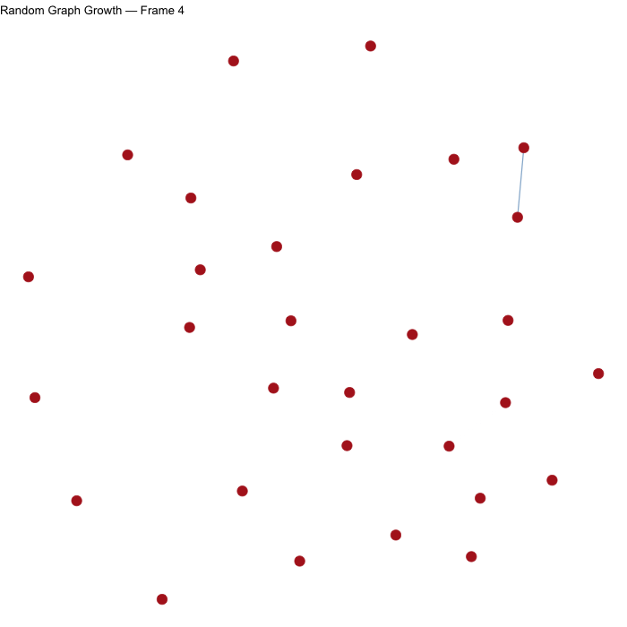

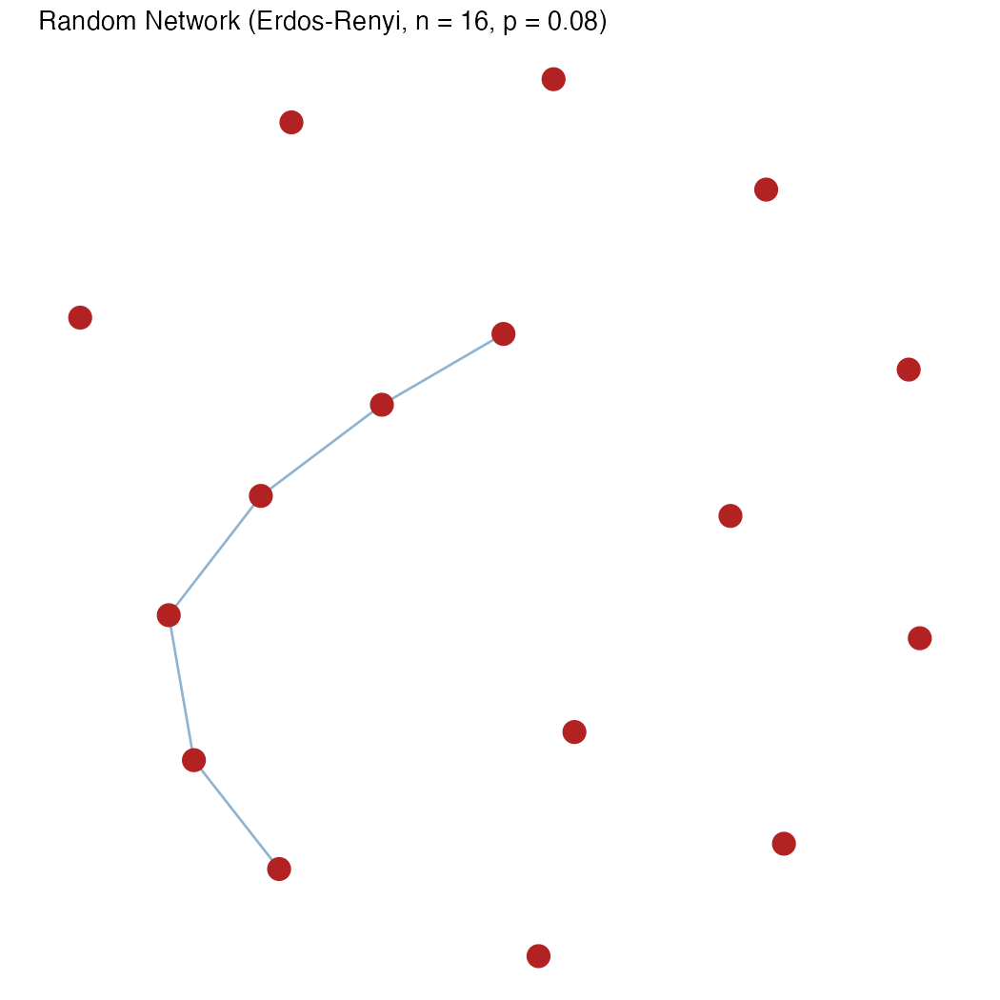
```
```{r}
#| label: small-worlds-2
#| fig-cap: ""
#| fig-subcap: 
#|  - Emergent
#|  - Final State
#| layout-ncol: 2
#| echo: false
#| eval: false
#| 

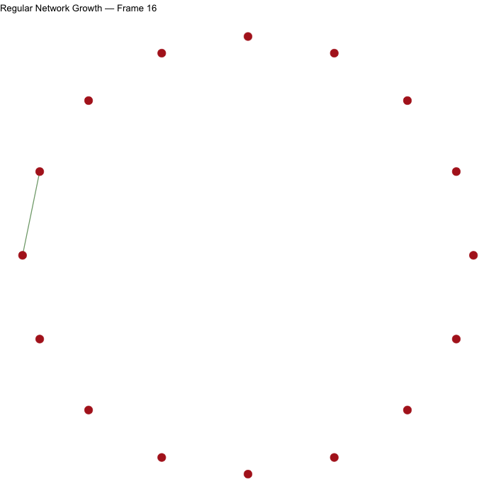

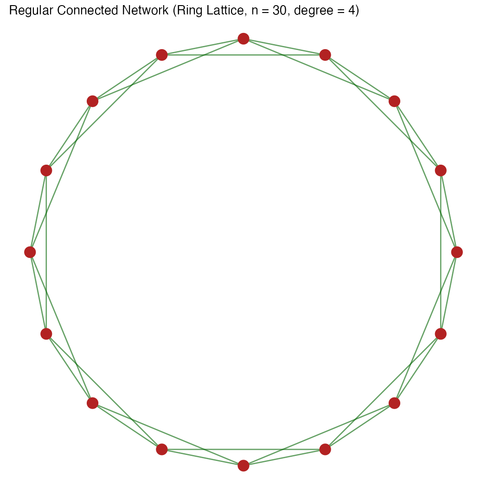

```

```{r}
#| echo: false
#| eval: false
#| 
# =========================================================
# Reproducing Figure 1 from Watts & Strogatz (1998)
# "Collective dynamics of 'small-world' networks", Nature 393
# =========================================================
# Figure 1 shows the random rewiring procedure that interpolates
# between a regular ring lattice (p = 0) and a random network
# (p = 1), passing through a "small-world" regime at intermediate p.
#
# Per the paper: "For clarity, n = 20 and k = 4 in the schematic
# examples shown here." Each vertex starts connected to its k
# nearest neighbours (k/2 on each side) on a ring; edges are then
# rewired to a uniformly random vertex with probability p (no
# duplicate edges, no self-loops), sweeping around the ring once
# per "distance" of neighbour, for k/2 total laps.
#
# igraph's sample_smallworld() implements exactly this
# Watts-Strogatz rewiring procedure.
#
# Output: watts_strogatz_figure1.png
# =========================================================

# ---- 1. Install packages (run once) ----
required_pkgs <- c("igraph", "ggraph", "tidygraph", "ggplot2", "patchwork")
missing_pkgs <- required_pkgs[!(required_pkgs %in% installed.packages()[, "Package"])]
if (length(missing_pkgs) > 0) install.packages(missing_pkgs)

library(igraph)
library(ggraph)
library(tidygraph)
library(ggplot2)
library(patchwork)

set.seed(1)

# ---- 2. Parameters matching the paper's schematic (n = 20, k = 4) ----
n <- 20
k <- 4
nei <- k / 2   # neighbours on each side, as required by sample_smallworld()

p_regular <- 0     # p = 0: unrewired ring lattice
p_small   <- 0.1   # intermediate p: "small-world" regime
p_random  <- 1     # p = 1: fully rewired, random network

# ---- 3. Generate the three graphs via Watts-Strogatz rewiring ----
g_regular <- sample_smallworld(dim = 1, size = n, nei = nei, p = p_regular)
g_small   <- sample_smallworld(dim = 1, size = n, nei = nei, p = p_small)
g_random  <- sample_smallworld(dim = 1, size = n, nei = nei, p = p_random)

# ---- 4. Helper to plot one panel on a circular layout ----
# All three use the same circular vertex arrangement (as in the
# original figure), so only the edges change across panels.
plot_panel <- function(g, title) {
  gt <- as_tbl_graph(g)
  ggraph(gt, layout = "circle") +
    geom_edge_arc(strength = 0.15, color = "black", alpha = 0.8, width = 0.4) +
    geom_node_point(size = 4, color = "black", fill = "white", shape = 21, stroke = 1) +
    coord_fixed() +
    theme_void() +
    labs(title = title) +
    theme(plot.title = element_text(hjust = 0.5, face = "bold", size = 13))
}

p1 <- plot_panel(g_regular, "Regular\n(p = 0)")
p2 <- plot_panel(g_small,   "Small-world\n(p = 0.1)")
p3 <- plot_panel(g_random,  "Random\n(p = 1)")

# ---- 5. Combine panels side by side with a caption, as in Fig. 1 ----
combined <- (p1 | p2 | p3) +
  plot_annotation(
    title = "Figure 1 (Watts & Strogatz, 1998): Random rewiring procedure",
    caption = "p = 0                              Increasing randomness                              p = 1",
    theme = theme(
      plot.title = element_text(hjust = 0.5, face = "bold", size = 14),
      plot.caption = element_text(hjust = 0.5, size = 11, face = "italic")
    )
  )

print(combined)

# ---- 6. Save as PNG ----
ggsave("./images/watts_strogatz_figure1.png", plot = combined, width = 12, height = 4.5, dpi = 150)

# ---- Notes ----
# - This reproduces the SCHEMATIC in Fig. 1 (n = 20, k = 4), used to
#   illustrate the rewiring mechanism, not Fig. 2's L(p)/C(p) curves
#   (which use n = 1000, k = 10, averaged over 20 realizations).
# - Because rewiring is stochastic, the "small-world" and "random"
#   panels will differ slightly each run unless you fix set.seed().
#   
```
```{r}
#| echo: false
#| eval: false

# =========================================================
# Reproducing Figure 2 from Watts & Strogatz (1998)
# "Collective dynamics of 'small-world' networks", Nature 393
# =========================================================
# Figure 2 shows the characteristic path length L(p) and clustering
# coefficient C(p) for the family of randomly rewired ring lattices
# from Fig. 1, each normalized by its value at p = 0, plotted
# against p on a log scale.
#
# Per the paper's Fig. 2 legend: "All the graphs have n = 1000
# vertices and an average degree of k = 10 edges per vertex... The
# data shown are averages over 20 random realizations of the
# rewiring process."
#
# L(p): mean shortest-path length (mean_distance in igraph)
# C(p): average LOCAL clustering coefficient (transitivity, type
#       = "average" in igraph -- this matches the paper's Cv-based
#       definition, not the global triangle-to-triple ratio)
#
# NOTE: this involves generating hundreds of 1000-node graphs and
# computing shortest paths / clustering on each, so it can take a
# few minutes to run. Reduce n_realizations, n, or the length of
# p_values below for a quicker (noisier) approximation.
#
# Output: watts_strogatz_figure2.png
# =========================================================

# ---- 1. Install packages (run once) ----
required_pkgs <- c("igraph", "ggplot2", "tidyr", "dplyr")
missing_pkgs <- required_pkgs[!(required_pkgs %in% installed.packages()[, "Package"])]
if (length(missing_pkgs) > 0) install.packages(missing_pkgs)

library(igraph)
library(ggplot2)
library(tidyr)
library(dplyr)

set.seed(1)

# ---- 2. Parameters matching the paper ----
n <- 1000
k <- 10
nei <- k / 2          # neighbours per side, required by sample_smallworld()
n_realizations <- 20  # averaged over 20 random realizations, as in the paper

# Log-spaced p values from 0.0001 to 1 (paper's x-axis range)
p_values <- 10^seq(log10(0.0001), log10(1), length.out = 20)

# ---- 3. Baseline L(0) and C(0) from the unrewired regular lattice ----
g0 <- sample_smallworld(dim = 1, size = n, nei = nei, p = 0)
L0 <- mean_distance(g0, directed = FALSE)
C0 <- transitivity(g0, type = "average")

cat(sprintf("Baseline regular lattice: L(0) = %.3f, C(0) = %.4f\n", L0, C0))

# ---- 4. Compute L(p) and C(p), averaged over multiple realizations ----
results <- data.frame(p = p_values, L = NA_real_, C = NA_real_)

for (i in seq_along(p_values)) {
  p <- p_values[i]

  L_vals <- numeric(n_realizations)
  C_vals <- numeric(n_realizations)

  for (r in 1:n_realizations) {
    g <- sample_smallworld(dim = 1, size = n, nei = nei, p = p)
    L_vals[r] <- mean_distance(g, directed = FALSE)
    C_vals[r] <- transitivity(g, type = "average")
  }

  results$L[i] <- mean(L_vals)
  results$C[i] <- mean(C_vals)

  cat(sprintf("p = %.5f  ->  L = %.3f, C = %.4f\n", p, results$L[i], results$C[i]))
}

# ---- 5. Normalize by the p = 0 baseline, as in the paper ----
results$L_norm <- results$L / L0
results$C_norm <- results$C / C0

# ---- 6. Reshape for plotting both curves together ----
plot_df <- results %>%
  select(p, L_norm, C_norm) %>%
  pivot_longer(cols = c(L_norm, C_norm), names_to = "metric", values_to = "value") %>%
  mutate(metric = recode(metric, L_norm = "L(p) / L(0)", C_norm = "C(p) / C(0)"))

# ---- 7. Plot: log-scale x-axis, points + line, matching Fig. 2 style ----
p_fig2 <- ggplot(plot_df, aes(x = p, y = value, color = metric, shape = metric)) +
  geom_line(linewidth = 0.5, alpha = 0.7) +
  geom_point(size = 2.5) +
  scale_x_log10(
    breaks = c(0.0001, 0.001, 0.01, 0.1, 1),
    labels = c("0.0001", "0.001", "0.01", "0.1", "1")
  ) +
  scale_color_manual(values = c("L(p) / L(0)" = "black", "C(p) / C(0)" = "black")) +
  scale_shape_manual(values = c("L(p) / L(0)" = 1, "C(p) / C(0)" = 16)) +
  labs(
    title = "Figure 2 (Watts & Strogatz, 1998): Small-world transition",
    x = "p",
    y = NULL,
    color = NULL,
    shape = NULL
  ) +
  theme_minimal(base_size = 13) +
  theme(
    legend.position = c(0.85, 0.85),
    panel.grid.minor = element_blank(),
    plot.title = element_text(hjust = 0.5, face = "bold", size = 12)
  )

print(p_fig2)

# ---- 8. Save as PNG ----
ggsave("./images/watts_strogatz_figure2.png", plot = p_fig2, width = 7, height = 5, dpi = 150)

# ---- Notes ----
# - The paper's key result: over a broad range of intermediate p,
#   L(p) drops rapidly toward the random-graph value while C(p)
#   stays close to its regular-lattice value -- this is the
#   "small-world" regime, and should be clearly visible as a
#   sharp early drop in the open circles (L) while the filled
#   circles (C) remain high for longer.
# - This is computationally heavier than Fig. 1's schematic; if it's
#   too slow, try n = 200-300 and/or n_realizations = 5-10 first to
#   confirm the script works, then scale up for a closer match.
#   
#   
```
```{r}
#| echo: false
#| label: fig-small-worlds
#| layout-ncol: 2
#| fig-align: center
#| fig-subcap: 
#|  - Increasing Random Links ( L to R )
#|  - \"Network Distance\" and \"Clustering\ vs Connection Probability"
#| out-width: "100%"
#| out-height: "100%"
#| 

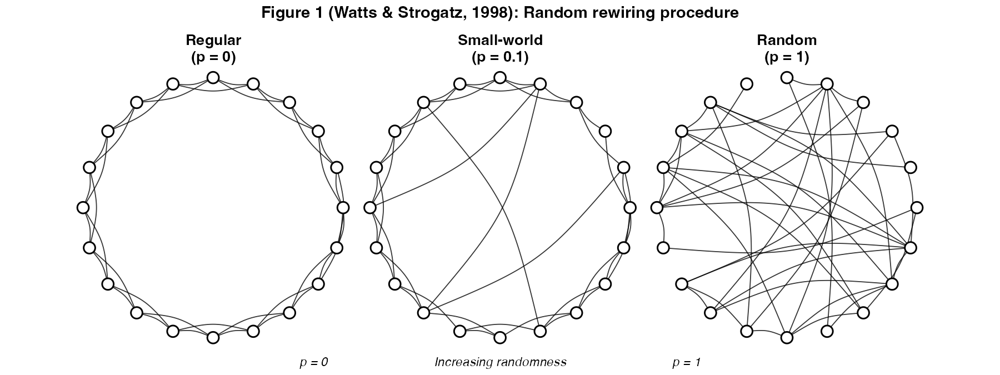
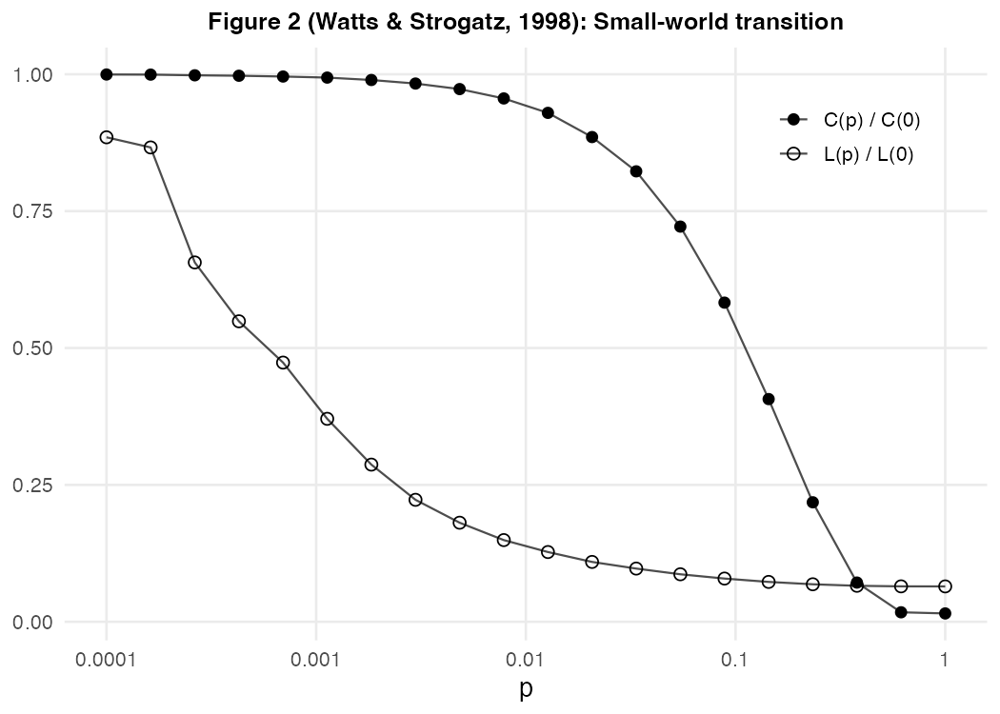
```


```{r}
#| echo: false
#| eval: false
#| 
# ============================================================
# Animated reproduction of Figure 1 from:
# Watts, D. J., & Strogatz, S. H. (1998).
# "Collective dynamics of 'small-world' networks." Nature, 393(6684), 440-442.
#
# The original Figure 1 shows three static snapshots of a ring lattice
# as edges are randomly rewired with probability p:
#   p = 0    -> regular ring lattice
#   p small  -> "small-world" network (few long-range shortcuts)
#   p = 1    -> random graph
#
# This script animates that entire process by smoothly sweeping p from
# 0 to 1 and rewiring edges one by one, while keeping node positions
# fixed on a circle (exactly as in the paper's figure) so the viewer
# can see individual edges "jump" from local to long-range connections.
#
# Requires: igraph, gifski
#   install.packages(c("igraph", "gifski"))
# ============================================================

library(igraph)
library(gifski)

set.seed(2026)

# ---------------------------
# Parameters (feel free to tweak)
# ---------------------------
N        <- 20   # number of nodes on the ring
K        <- 4    # each node initially connects to K nearest neighbors (K/2 per side)
n_frames <- 90    # number of animation frames
gif_file <- "watts_strogatz_animation.gif"

# Use a log-ish spacing for p so the interesting transition region
# (small p) gets more frames, similar to how the paper emphasizes
# the log-scale x-axis in Figure 2. Start at exactly 0.
p_values <- c(0, exp(seq(log(1e-3), log(1), length.out = n_frames - 1)))

# ---------------------------
# Build the base ring lattice edge list
# ---------------------------
build_ring_lattice <- function(N, K) {
  edges <- matrix(ncol = 2, nrow = 0)
  for (i in 1:N) {
    for (j in 1:(K / 2)) {
      neighbor <- ((i - 1 + j) %% N) + 1
      edges <- rbind(edges, c(i, neighbor))
    }
  }
  edges
}

base_edges <- build_ring_lattice(N, K)
n_edges    <- nrow(base_edges)

# ---------------------------
# Pre-compute, for every edge, a random "rewiring threshold" and a
# random alternative target node. As p sweeps upward, any edge whose
# threshold is below the current p becomes rewired to its pre-chosen
# random target. This makes the animation deterministic frame-to-frame
# (no flickering) while still reproducing the WS rewiring procedure.
# ---------------------------
thresholds <- runif(n_edges)

rewired_targets <- sapply(base_edges[, 1], function(i) {
  repeat {
    candidate <- sample(setdiff(1:N, i), 1)
    if (candidate != i) break
  }
  candidate
})

# ---------------------------
# Construct the graph corresponding to a given value of p
# ---------------------------
make_graph_at_p <- function(p) {
  el <- base_edges
  rewire_idx <- which(thresholds <= p)
  el[rewire_idx, 2] <- rewired_targets[rewire_idx]
  g <- graph_from_edgelist(el, directed = FALSE)
  simplify(g, remove.multiple = TRUE, remove.loops = TRUE)
}

# Fixed circular layout so nodes never move -- only edges change,
# exactly matching the visual style of the original Figure 1.
layout_coords <- layout_in_circle(graph_from_edgelist(base_edges, directed = FALSE))

# ---------------------------
# Render the animation
# ---------------------------
save_gif({
  for (p in p_values) {
    g <- make_graph_at_p(p)

    plot(
      g,
      layout        = layout_coords,
      vertex.size   = 10,
      vertex.color  = "steelblue",
      vertex.frame.color = "white",
      vertex.label  = NA,
      edge.color    = adjustcolor("gray30", alpha.f = 0.7),
      edge.width    = 1.2,
      edge.curved   = 0.15,
      main          = sprintf("Watts-Strogatz rewiring:  p = %.4f", p)
    )
  }
}, gif_file = gif_file, width = 700, height = 700, delay = 1 / 15, loop = TRUE)

cat("Animation saved as:", gif_file, "\n")

```
```{r}
#| label: fig-small-world-animated
#| fig-cap: Small World Construction (Emergent)
#| echo: false
#| out-width: "80%"
#| out-height: "80%"

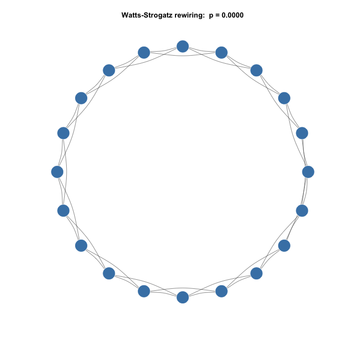

```

In @fig-small-worlds-2, look at the two curves: the [black curve]{.white .bg-black} for $C(p)$ shows the presence of *communities* or clusters: high at first and then as random re-wirings take over, falling in *cliff-like* fashion. The [gray curve]{.white .bg-gray} for $L(p)$ shows the *average path length* between nodes: high at first, then falling rapidly as random re-wirings create shortcuts across the network. 

The region where $C(p)$ is still high, and $L(p)$ is already low, is what makes a network a *small world*: high clustering and short average path lengths.

### Granovetter: Strength of Weak Ties

A very related model is called "the Strength of Weak Ties". [Granovetter](https://snap.stanford.edu/class/cs224w-readings/granovetter73weakties.pdf) showed that in social networks, weak ties (acquaintances) are more important than strong ties (close friends) for spreading information. This is because weak ties connect different communities, allowing information to flow across the network.

Weak ties (acquaintances, infrequent or low-intensity connections) are more important for spreading information, opportunities (e.g., job leads, college admissions!), and innovation across social groups than strong ties (close friends/family).

Strong ties create dense, overlapping clusters (high local redundancy; your friends know each other).
Weak ties act as local bridges connecting otherwise separate clusters, providing access to *novel information*. Empirical observation: People often find jobs through weak ties rather than close friends, because strong-tie circles share similar information.

This highlights a tension: social networks are locally clustered (via strong ties and triadic closure) but globally connected via weak ties.

In a sense, Watts-Strogatz's model provides the math justification for Granovetter's empirical observation: the small-world property allows for efficient information flow across a network, even if most connections are local.

### Albert-László Barabási and Réka Albert: Preferential Attachment

If you were signing up for a new social media platform, would you rather follow a random user or the most popular user? Most people would choose the latter. This is the essence of `preferential attachment`, a concept that explains how networks grow and evolve over time.

```{r}
#| label: preferential-attachment-animated
#| echo: false
#| eval: false
#| 
# =========================================================
# Animated Preferential Attachment Network in R
# =========================================================
# Simulates a Barabasi-Albert style network: nodes are added
# one at a time, and each new node attaches to existing nodes
# with probability proportional to their current degree
# ("rich get richer"). The animation reveals nodes and edges
# in the order they were actually created, on a fixed final
# layout, and node size grows with degree so hubs visibly
# emerge over time.
#
# Output: preferential_attachment_animation.gif
# =========================================================

set.seed(2026)

# ---- 2. Generate the network via preferential attachment ----
# Barabasi-Albert model: each new node connects with m edges,
# chosen preferentially toward higher-degree existing nodes.
n_nodes <- 30
m <- 2   # edges each new node brings when it joins

g <- sample_pa(n = n_nodes, power = 1, m = m, directed = FALSE)
g_tbl <- as_tbl_graph(g)

# ---- 3. Fixed layout computed on the FINAL graph ----
# Using the final layout (rather than recomputing per step) keeps
# node positions stable across frames so the animation reads as
# "reveal", not a jittery re-arrangement.
layout_coords <- create_layout(g_tbl, layout = "fr")
node_coords <- layout_coords[, c("x", "y")]
node_coords$name <- 1:nrow(node_coords)

# ---- 4. Determine when each node/edge "arrives" ----
# Vertices are numbered in the order they were added (1, 2, ..., n),
# so a vertex's id IS its arrival frame. An edge always connects a
# newly arriving node to an earlier one, so the edge's frame is the
# larger of its two endpoint ids.
n_frames <- n_nodes

edge_df <- as.data.frame(g_tbl %>% activate(edges) %>% as_tibble())
edge_df$appear_frame <- pmax(edge_df$from, edge_df$to)

node_df <- node_coords
node_df$appear_frame <- node_df$name

# ---- 5. Build per-frame data (cumulative reveal + growing degree) ----
edge_frames <- do.call(rbind, lapply(1:n_frames, function(f) {
  visible <- edge_df[edge_df$appear_frame <= f, ]
  if (nrow(visible) == 0) return(NULL)
  visible$frame <- f
  visible
}))

edge_frames$x    <- node_coords$x[edge_frames$from]
edge_frames$y    <- node_coords$y[edge_frames$from]
edge_frames$xend <- node_coords$x[edge_frames$to]
edge_frames$yend <- node_coords$y[edge_frames$to]

node_frames <- do.call(rbind, lapply(1:n_frames, function(f) {
  visible <- node_df[node_df$appear_frame <= f, ]
  if (nrow(visible) == 0) return(NULL)

  # Degree using only edges that have appeared by this frame,
  # so node size visibly grows as hubs accumulate connections.
  edges_so_far <- edge_df[edge_df$appear_frame <= f, ]
  deg_counts <- table(c(edges_so_far$from, edges_so_far$to))
  visible$degree <- as.numeric(deg_counts[as.character(visible$name)])
  visible$degree[is.na(visible$degree)] <- 0

  # Highlight the node that just arrived this frame
  visible$is_new <- visible$appear_frame == f
  visible$frame <- f
  visible
}))

# ---- 6. Build the animated plot ----
p <- ggplot() +
  geom_segment(
    data = edge_frames,
    aes(x = x, y = y, xend = xend, yend = yend),
    color = "steelblue", alpha = 0.5, linewidth = 0.5
  ) +
  geom_point(
    data = node_frames,
    aes(x = x, y = y, size = degree + 2, color = is_new)
  ) +
  scale_size_identity() +
  scale_color_manual(values = c(`FALSE` = "firebrick", `TRUE` = "orange"), guide = "none") +
  theme_void() +
  labs(title = "Preferential Attachment Growth — Node {closest_state} of {n_nodes}") +
  transition_states(frame, transition_length = 1, state_length = 1) +
  ease_aes("linear")

# ---- 7. Render and save as GIF ----
anim <- animate(
  p,
  nframes = n_frames * 2,
  fps = 8,
  width = 600, height = 600,
  renderer = gifski_renderer()
)

anim_save("./images/preferential_attachment_animation.gif", animation = anim)

# ---- Done ----
# Open "preferential_attachment_animation.gif" to view the animation:
# nodes join one at a time, orange marks the newest arrival, and
# point size scales with degree -- so you can watch a small number
# of nodes accumulate disproportionately many connections, the
# signature "rich get richer" pattern of preferential attachment.
# 
```

```{r}
#| label: preferential-attachment-static
#| eval: false
#| echo: false
#| 
# =========================================================
# Static Preferential Attachment Network in R
# =========================================================
# Builds a Barabasi-Albert style network (preferential
# attachment) and plots the final result once, with node
# size scaled by degree so hubs are visually apparent.
# No animation.
#
# Output: preferential_attachment_static.png
# =========================================================

# ---- 2. Generate the network via preferential attachment ----
# Barabasi-Albert model: each new node connects with m edges,
# chosen preferentially toward higher-degree existing nodes.
# n_nodes <- 30
# m <- 2   # edges each new node brings when it joins
# 
# g <- sample_pa(n = n_nodes, power = 1, m = m, directed = FALSE)
# g_tbl <- as_tbl_graph(g)

# ---- 3. Add degree as a node attribute (for sizing hubs) ----
g_tbl <- g_tbl %>%
  activate(nodes) %>%
  mutate(degree = centrality_degree())

# Sanity checks (optional, printed to console)
cat("Connected:", is_connected(as.igraph(g_tbl)), "\n")
cat("Degree range:", range(degree(as.igraph(g_tbl))), "\n")

# ---- 4. Plot with a force-directed layout ----
p <- ggraph(g_tbl, layout = "fr") +
  geom_edge_link(color = "steelblue", alpha = 0.5, width = 0.5) +
  geom_node_point(aes(size = degree + 2), color = "firebrick") +
  scale_size_identity() +
  theme_void() + coord_fixed() +
  labs(title = "Preferential Attachment Network (Barabasi-Albert, n = 30, m = 2)")

print(p)

# ---- 5. Save as PNG ----
ggsave("./images/preferential_attachment_static.png", plot = p, width = 7, height = 7, dpi = 150)

```

```{r}
#| label: fig-preferential-attachment
#| fig-cap: ""
#| fig-subcap: 
#| - Preferential Attachment Emerging
#| - Resulting Network
#| echo: false
#| layout-ncol: 2
#| 

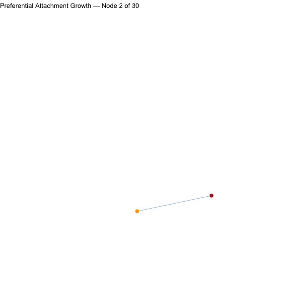
                        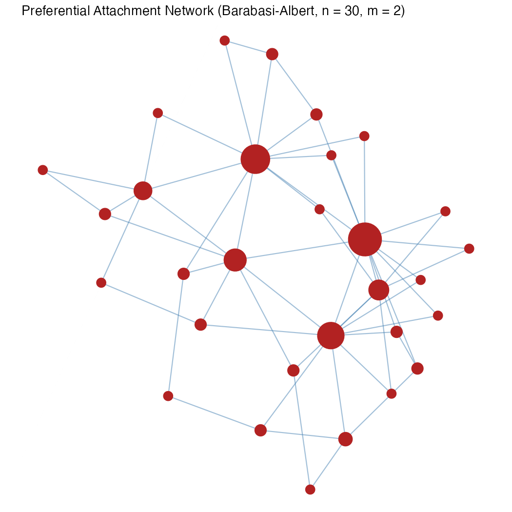

```

When new nodes are added to a growing network (like web pages or people joining social media), they are more likely to connect to existing nodes that already have many connections. This creates a [***"rich get richer" effect***](http://www.cs.cornell.edu/home/kleinber/networks-book/networks-book-ch18.pdf). This is akin to the [Matthew Effect](https://researchonresearch.org/largest-study-of-its-kind-shows-that-the-matthew-effect-in-science-funding-holds-true/) from the Bible:

```{r}
#| label: fig-bible
#| fig-cap: Matthew Effect
#| fig-align: center
#| out-height: "80%"
#| out-width: "80%"
#| echo: false

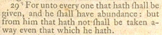

```

###### Some examples:

- Imagine a school where kids form friendships.The kid who has the most friends is always invited to more parties (gets more invitations). A new student joins and wants to make friends—instead of randomly picking someone, they choose the kid with the biggest social circle because that's where the "buzz" is.
- The Internet topology (where some servers are connected to thousands of others)
- Social media networks (a few influencers have millions of followers)
- Biological protein interaction networks (some proteins interact with far more partners than most)

The model is a simplified abstraction, but it provides critical insight into why real-world complex systems exhibit such specific (and to some people, vexing) statistical properties.

###### Implications

- `Power-law degree distribution`: The probability $P(k)$ that a node has k connections follows a power law: $P(k) ∝ k^{-γ}$. This means most nodes have very few connections, but a small number of "hubs" dominate. 

```{r}
#| eval: false
#| echo: false
#| 
library(igraph)
library(dplyr)
library(ggplot2)
library(gganimate)

set.seed(2026)

# Parameters -------------------------------------------------------------
n_nodes  <- 2000   # final network size (larger -> clearer tail) [web:76][web:78]
m_attach <- 2      # edges added per new node (BA parameter) [web:72][web:79]
n_steps  <- 10     # how many intermediate snapshots to animate

# 1) Generate a preferential-attachment graph ---------------------------
# sample_pa implements a Barabási–Albert-style PA model [web:60][web:61].
g <- sample_pa(n = n_nodes,
               m = m_attach,
               directed = FALSE)

# 2) Degree distribution at multiple growth stages ----------------------
# We’ll look at snapshots at evenly spaced sizes of the network.
snap_sizes <- round(seq(200, n_nodes, length.out = n_steps))

deg_snapshots <- lapply(snap_sizes, function(N) {
  # Induced subgraph with first N nodes
  gN <- induced_subgraph(g, vids = seq_len(N))
  deg <- degree(gN)
  tibble(
    k    = as.integer(names(table(deg))),         # degree values [web:78]
    freq = as.numeric(table(deg)) / N,            # relative frequency
    N    = N
  )
})

deg_df <- bind_rows(deg_snapshots)

# 3) Log–log plot of degree distribution --------------------------------
# This is a standard way to visually assess power-law behavior [web:71][web:76].
p <- ggplot(deg_df, aes(x = k, y = freq, group = N)) +
  geom_point(alpha = 0.8, size = 2.5, colour = "steelblue") +
  scale_x_log10("Degree (k)", breaks = c(1, 2, 5, 10, 20, 50, 100)) +
  scale_y_log10("P(k)", breaks = c(1e-4, 1e-3, 1e-2, 1e-1)) +
  ggtitle("Preferential attachment network",
          subtitle = "Degree distribution P(k) on log–log scale\nNodes: {closest_state}") +
  theme_minimal(base_size = 16) +
  theme(
    plot.title = element_text(size = 20, face = "bold",
                              margin = margin(b = 8)),
    plot.subtitle = element_text(size = 15,
                                 margin = margin(t = 12)),
    panel.grid.minor = element_blank()
  ) +
  transition_states(
    states = N,
    transition_length = 2,
    state_length = 1
  )

# Bigger canvas: width and height in pixels
anim <- animate(
  p,
  nframes = 80,
  fps = 10,
  width = 800,   # was 800
  height = 600,   # was 600
  res = 120       # higher DPI for sharper text
)
anim_save("./images/pa_degree_powerlaw.gif", anim)

```

```{r}
#| label: fig-power-law
#| fig-cap: Power Law for Node Degree with Preferential Attachment
#| fig-align: center
#| echo: false

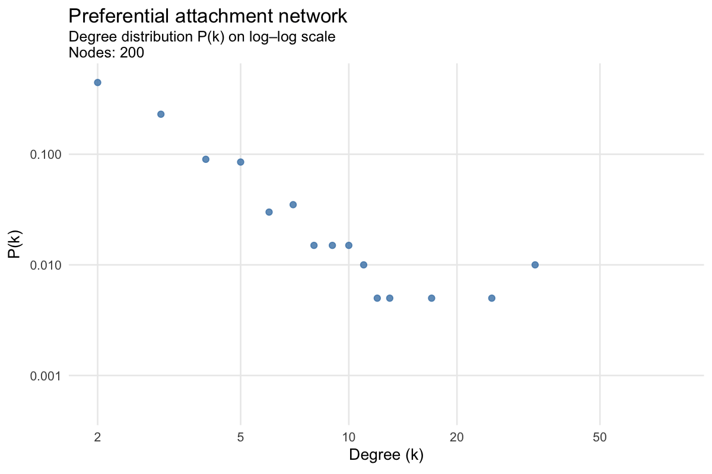
```


- `Self-reinforcing growth`: As the network grows, hubs become even larger because they attract more connections.
- `Emergence of scale-free structure`: Over time, this process creates networks with an infinite number of possible connection paths and robustness against random failures. <https://mathinsight.org/scale_free_network> 

###### Why It Matters in Art/Design

- The robustness of infrastructure networks (many small links can fail, but hubs remain). OTOH, if these hubs fail, the network comes to a halt. So more money, typically, would be spent in protecting hubs. 
- The spread of information or disease through a population is controlled by hubs. Innoculate them, and you are better off.
- If one is on a fund-raising platform, add some seed funds to each new user, and they will be more likely to attract more funds. This is a preferential attachment effect.

## Discussion and Questions

- *Random* is equal; but do we want *equal* when we want designs, policies, ads to work?
- Are heavy-tailed distributions a bad thing? 
- Can network-oriented designs (are there any other kind??) work without creating heavy-tailed distributions?
- Can a business survive serving the non-heavy side of the distribution? (E.g. stocking books by authors who are not best-sellers, or selling to people who are not influencers.) How?
- Can niche be a...niche?


## Conclusions

- We **are** network. Maybe we should make a movie titled ~~I,Robot~~ *We, Network*.
- Our Culture, Inventions, Business, Creations are all solidly linked to the Networks we are embedded in. 
- Note what [Naval Ravikant](https://nav.al/) says "The three big decisions – what you do, where you live, and who you’re with."


## References

1.  The Network Effects Bible.
    <u><https://www.nfx.com/post/network-effects-bible></u>
1. Herbert Simon. <https://thedecisionlab.com/thinkers/computer-science/herbert-simon>
1. Duncan Watts and Steven Strogatz. (1998). *Collective dynamics of 'small-world' networks*. Nature 393, 440–442. <https://snap.stanford.edu/class/cs224w-readings/watts98smallworld.pdf>
1. The Startup Junkie.* How to be a Connector*. <https://startupjunkie.org/2021-12-1-the-power-of-weak-ties-tips-on-how-to-become-the-connector/>
1. Ran Katzir. *Experience Network Science through Play*. <https://medium.com/@ran_katzir/teaching-network-science-using-board-games-f78489a3b3bd> ( Describes an in-design board game.)
1.  Mitchell Resnick. *Beyond the Centralized Mindset*.
    <u><https://web.media.mit.edu/~mres/papers/JLS/JLS-1.0.html></u>
1.  Thomas W. Valente.(2012). *Network Interventions*. Science(337) 49.
    Available here <u><https://sci-hub.se/10.1126/science.1217330></u>. The term “network interventions” describes the process of using social network data to accelerate behavior change or improve organizational performance. In this Review, four strategies for network interventions are described, each of which has multiple tactical alternatives.
1.  Nicholas Christakis. (May 3, 2024). To exploit social contagion,
    tools are needed to efficiently identify individuals who are better
    able to initiate cascades. To be maximally useful, such tools should
    be deployable without having to actually map face-to-face social
    network interactions. <https://t.co/DHCKxXeGYg>. This is a paper that presents design tools that exploit the "Friendship Paradox" to create Social Contagion. A quick summary of the paper is available here. <https://www.science.org/doi/10.1126/science.adi5147>
1. David Pinsoff. (Dec 2025).*Everything is Bullshit* Substack. <https://www.everythingisbullshit.blog/p/a-big-misunderstanding>
1. fee.org.(Wednesday, September 19, 2018
)*How Can Game Theory Prevent Disease Outbreaks.*<https://fee.org/articles/how-game-theory-can-help-prevent-disease-outbreaks/> 


## Important Papers in Network Science

1. Watts and Strogatz on `Small Worlds`


1. Vespigniani on Hubs

1.  Mark Newman, *The Physics of Networks*. Good intro Power Laws and examples of many networks.

1. Mark Granovetter. (1973). *The Strength of Weak Ties*. American Journal of Sociology 78(6): 1360–1380. 

## Fun Stuff ( ha!)
1. Puzzles and Games for Graph Theory. <https://www.tes.com/teaching-resource/graph-theory-puzzles-and-games-12164908>
1. The Erdos Number Projects. <https://sites.google.com/oakland.edu/grossman/home/the-erdoes-number-project>
1. Collab Distance! <https://mathscinet.ams.org/mathscinet/freetools/collab-dist>
1. The Srishti Distance Project. <https://There_ain't_no_such_website_yet.html> Unless you count PDAs. 

