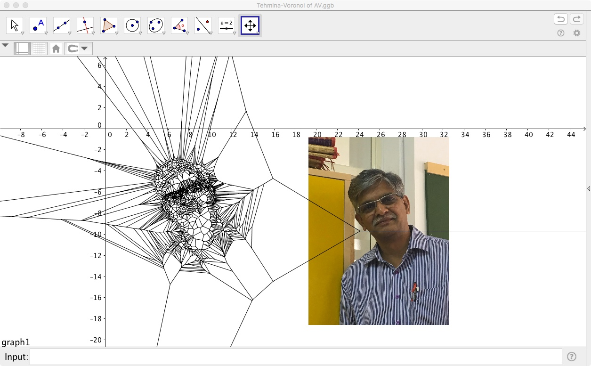
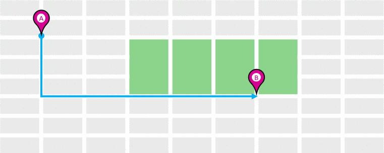
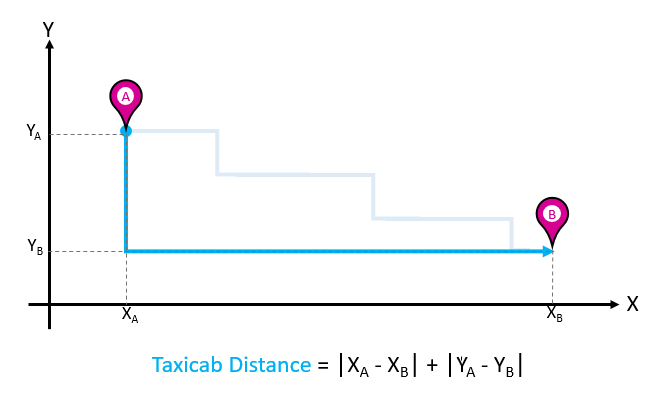
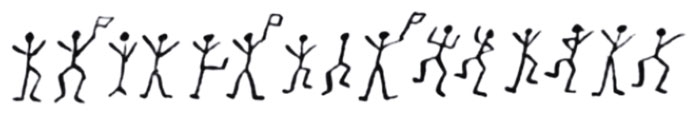
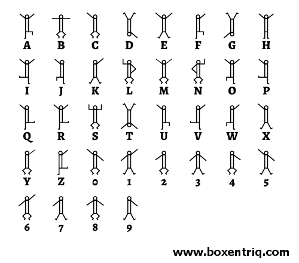

```{r setup, echo=FALSE, message=FALSE,warning=FALSE}
library(blogdown)
library(emoji)
##
library(LearnGeom)
library(TurtleGraphics)
library(deldir)
library(tidyverse)
library(ggformula)
library(ggvoronoi)
library(lattice)
library(latticeExtra)

```


## A Model for Proximity: The Delaunay Triangulation and the Voronoi Diagram 

So how do we model "proximity"? Let us take a quick look at this
description of **Predator-Prey Dynamics.**



### Plotting the Delaunay and Voronoi Diagrams

So here is an example of a computationally plotted Delaunay
Triangulation and Voronoi Diagram:

```{r}
#| label: fig-voronoi-delaunay
#| echo: false
#| layout-ncol: 3
#| out-width: "120%"
#| out-height: "120%"
#| fig-cap: "Spatial Partitionings"
#| fig-subcap: 
#| - Delaunay Triangulation
#| - Voronoi Diagram
#| - Both Overlaid
#| 
set.seed(1963)

x <- runif(n = 30, min = -10,10)
y <- rnorm(n=30, mean = 0, sd = 5)
z <- rpois(30, lambda = 5)
data <- data.frame(x,y,z)
vor <- deldir(x,y)
##
# v <- tile.list(vor)
# base::plot(v, showpoints = TRUE, 
#      col.pts = "red",
#      pch = 18, 
#      border = "green", xlim = c(-20, 20))
##
# del <- deldir(x,y, wl = "tr")
# d <- tile.list(del)
# base::plot(d, showpoints = TRUE, 
#      col.pts = "red",
#      pch = 18, 
#      border = "green", xlim = c(-20, 20))
##
# ggplot(data) +
#   geom_voronoi(aes(x = x, y = y, fill = z), 
#                colour = "green") +
#   geom_point(aes(x,y), colour = "white") +
#   theme_minimal()
##
gf_segment(y1 + y2 ~ x1 + x2, data = vor$delsgs, colour = "green") %>% 
  gf_point(data = data, y ~ x, color = "red", 
           inherit = F,size = 4,
           title = "Delaunay Triangulation") %>%
  gf_refine(coord_fixed()) %>% 
  gf_theme(theme_minimal())
##
gf_segment(y1 + y2 ~ x1 + x2, data = vor$dirsgs, colour = "purple") %>% 
  gf_point(data = data, y ~ x, color = "red", 
           inherit = F, size = 4,
           title = "Voronoi Diagram") %>%
    gf_refine(coord_fixed()) %>% 
    gf_theme(theme_minimal())
##
gf_segment(y1 + y2 ~ x1 + x2, data = vor$delsgs, colour = "green") %>% 
  gf_segment(y1 + y2 ~ x1 + x2, data = vor$dirsgs, colour = "purple", inherit = F) %>% 
  gf_point(data = data, y ~ x, color = "red", 
           inherit = F,size = 4,
           title = "Delaunay and Voronoi Overlay") %>%
  gf_refine(coord_fixed()) %>% 
  gf_theme(theme_minimal())

```

How do we plot these diagrams?

We will use this tool:[**Geogebra**](https://www.geogebra.org/classic)

Download and install this on your laptops. You can also use it in your
browser <https://www.geogebra.org/classic?lang=en> and download
the Geogebra (*.ggb*) files that you create. Let us first see Soho with the Voronoi Diagram, and then we make such a diagram step by step. 

1.  Exercise 1: Download [this `.ggb` file](../../../../materials/pdfs/SohoMap.ggb)</u> and open it in Geogebra.
1.  Exercise 2: Let us try with just three points and see what we need
    to do to plot the Voronoi Diagram.
1.  Exercise 3: With 4 points: [Four Pointer Voronoi](../../../../materials/pdfs/four points.ggb)
1.  Exercise 4: Let us now add more points. How do we make a multi-point Voronoi? We need to make a [**"list of points" in Geogebra**](../../../../materials/pdfs/VoronoiLargeNoOfPointsInGeogebra.pdf).

### Discussion

-   Did you see how the Delaunay Triangulation seems to "dislike"
    obtuse-angles, and changes the triangulation pattern when a certain
    (sum of) angles become more than 180?
-   Wasn't that a very Kandinsky-like thing to do, even for an
    algorithm?
-   The Delaunay Triangulation gives us a set of triangular elements
    that cover our desired surface
-   The Voronoi Diagram uses the Delaunay to give us *possibly infinite* proximal neighbourhoods.

## Fun Stuff with Geogebra and Voronoi

1.  **Predator Prey Movement**....\
    -   Create a set of points in Geogebra.
    -   Colour/Shape one of the outermost points as a predator which circles the herd.
    -   Use the Voronoi diagram to model the *Zone of Danger* for each of the animals in the inner herd.
    -   Try **Animation** in Geogebra !!
2.  **Service Areas with Voronoi**\
    -   Import a 5km \* 5km square of area in your home town, from Google Maps, into Geogebra.
    -   Locate points of interest, all in one category ( ATMs, Post Offices, Hospitals, Police Stations...)
    -   Plot the Voronoi Diagram to show the area served by each such
    institution.
    -   Calculate the area in Geogebra.
    -   Assume a flat population/sqkm and use that to calculate the number of people served by each.
    - **All** of this can be done without leaving Geogebra !!
3.  **Voronoi Portraits and Facial Recognition**\
    - A. *My name is Arnold Schwarzenegger*\
      -   Take a picture of yourself and import it into Geogebra
      -   Plot Points on the Portrait such that the main facial features are defined.
      -   Use a Delaunay Triangulation of these points to create a Portrait.
                  <br>
    - B. *My Face is My Fortune*\
      -   Do the same for a famous person, past or present.
      -   Run a small survey in the class to see how many people can recognize the celebrity!
      

## Other Distances?

### Hamming Distances

We have used the simplest and most common of geometric distances between entities, the **Euclidean Distance** to model proximity. Are there other *measures of distance*?

-   How would you measure distance between *digital words*? For example
    $10010011$ and $11011011$?

> The **Hamming distance** between two equal-length strings of symbols
> is the number of positions at which the corresponding symbols are
> different. The symbols may be letters, bits, or decimal digits, among
> other possibilities. For example, the Hamming distance between:
> "karolin" and "kathrin" is 3. "karolin" and "kerstin" is 3. "kathrin"
> and "kerstin" is 4. 0000 and 1111 is 4. 2173896 and 2233796 is 3.

The Hamming Distance can be calculated using a logical operation known
as ["Exclusive-OR" or "XOR"](https://www.khanacademy.org/computing/computer-science/cryptography/ciphers/a/xor-bitwise-operation).

### Great Circle Distances

How would you measure distance over a *curved surface* such as the
earth?

View the path here: <https://www.greatcirclemap.com/>.
Calculate distances here: <https://www.gpsvisualizer.com/calculators>.

### Taxicab Distances

And if a *man hatta* live in New York?

{fig-align="center"}

{fig-align="center"}

We will use the Euclidean and maybe other concepts of distance when we get into our Machine Learning models!

### Plotting Silhouette Diagrams

To be written up!!
<https://orange3.readthedocs.io/projects/orange-visual-programming/en/latest/widgets/visualize/silhouetteplot.html>

## So where are all these Proximities used?

### Proximities in the GPS System

The GPS system is all about wanting to know if one is *proximate* to a
desired landmark! But how does it work?

Based on a measurement of two proximity scores, both electronic. One in
Space and one in Time. Oooh, cryptic, isn't it? Here is how it works:

-   Users receive GPS transmissions from more than one satellite (to
    improve accuracy; more later).
-   Each Satellite is given a **unique digital signature code**, called
    its *Coarse/Acquisition*, or C/A Code.
-   This code is a digital one-zero based sequence, which repeats after
    a week.
-   The code ones and zeroes are called **chips**; the chips are output
    by each satellite at a rate of 1.023 MHz. ( i.e. a little faster
    than a million chips per second)
-   All satellites use an on-board time clock. All satellites are
    synchronized and it is the same time on all satellites, regardless
    of where they are in the sky.
-   A User Receiver cannot understand what the satellite is saying,
    UNLESS it removes/wipes off the signature used by the satellite. So
    think of this in ***proximity*** terms: the user needs to know the
    Signature Sequence and also be **in sync aligned** with it, chip for
    chip.
-   One the signature is removed, what remains is what the satellite is
    saying.
-   GPS#5 उवाच:
    -   "It is 4 PM on my onboard clock";
    -   "The ionosphere is doing weird things so please include that
        weirdness in your position computation etc";
    -   Other stuff, called the **satellite ephimeris** (which we may
        discuss in class)

But [Houston, we have a problem](https://youtu.be/YwG4F-16Tno),
but right here on the ground, mercifully. The problem is, wait for it,
**the Speed of Light**. And it is a **good problem to have**.

-   When you detect say GPS#5 saying it is 4 PM, that signal came from
    GPS#5 to you at the speed of light, so ***by the time it arrives***,
    the time on the satellite is already 4PM + 150 microseconds.
-   Since different GPS satellites we can see are at different
    ***ranges***, we receive different times from 5 different GPS
    satellites.
-   Then we can set up a set of linear matrix equations in these
    variables:
    -   "Received Time" from each satellite (***Pseudo-Range***)
    -   Long and Lat (called a ***Position Fix***);
    -   Absolute Time (***Time Fix***)
-   Which we solve to obtain both Position Fix and Time Fix.

So in summary, the user needs to calculate two proximities:

-   A **C/A code proximity**, measured by the Hamming Distance between
    the received code and a locally generated C/A code. Which code to
    generate locally? We don't really know, so we generate ~ *all*.
    Huh, what!!! And select that C/A code to wipe off which shows good proximity with received C/A code. [(This is called, in telecom language, a
    ***Code Matched Filter*** and ***Rake Receiver***. Ask me what this
    looks like, at your peril.)]{.black .bg-gold}
-   A **Time Proximity**, by correcting its own local clock to match the
    satellite clocks, accurately. (This is called, in telecom language
    again, a **Delay-Lock Loop**. Peril again.)

### Code Proximity Measurement

Here is a block diagram of the **Code Matched Filter**:
```{r}
#| echo: false
#| label: fig-code-mf
#| fig-cap: "Code Matched Filter or Correlator"

knitr::include_graphics("https://gssc.esa.int/navipedia/images/7/73/Corr_block.png")

```

And here is a output of the **Code Matched Filter**:
```{r}
#| echo: false
#| label: fig-code-autocorr
#| fig-cap: "Code Matched Filter Output"

knitr::include_graphics("https://gssc.esa.int/navipedia/images/8/88/Corr_prn.png")

```


In the @fig-code-autocorr above, the red curve shows the Hamming
Distance between a received C/A code, and its locally generated copy.
Only when the proximity between them is within one-chip does the measure
have any sensible amplitude. (This is called ***Autocorrelation***.)

The blue curve show Hamming Distance proximity between a received C/A
code and **any other** C/A code. At no overlap position do these
dissimilar codes have a useful proximity measure. (This is known as
**Cross-Correlation**).

C/A codes are ***designed*** to have that spike-like autocorrelation,
and that fuzz like cross-correlation to aid in proximity-based
synchronization and code wipe-off.

### A Brief Foray into Cryptography

In the Sherlock Holmes story,[**The Adventure of the Dancing
Men**](https://www.gutenberg.org/files/108/108-h/108-h.htm#chap03),
a criminal known the one of the characters communicates with her using a
childish/child-like drawing which looks like this:

{fig-align="center"}

In this message, each character is a visual
representation, or a **substitution* for, a letter from the alphabet. The characters with flags are the last letter in each word. The message is translated in the story as *"Am here, Abe Slaney"*.

The entire **code alphabet** is shown in the figure below:

```{r, echo=FALSE, out.width = "360px", out.height = "360px", fig.align='center'}


```


This code is a good example of a [**Substitution
Cipher**](https://www.geeksforgeeks.org/substitution-cipher/) with
non-text substition. See <https://www.boxentriq.com/code-breaking/dancing-men-cipher> and
<https://www.dcode.fr/dancing-men-cipher> for examples where you
can encode and decode your own text, and send them to friends.
`r emoji::emoji("sunglasses")` `r emoji::emoji("smirk_cat")`

The intent behind any substitution cipher is to be create **distance**
from the original message, or characters. The algorithms to encode and
decode uses this idea of **distance** to perform their operations and
are entirely reversible.

## Painting with Proximity/Distance

Well, all right, all right, tech is fine. Can we use the idea of
Proximity to create **art**? Well, we are not Kandinsky, but we can try.
Here goes:

-   Fire up the Strava app, or equivalent, on your phones.
-   Walk out into the college campus, preferably under open sky.
-   With the app on, try to create a figure [like
    this](https://gpsart.info/en/gpsart-en/nowhow1-en/)
-   Share the image with your friend!

## [Wait, But Why?](https://waitbutwhy.com)

Here are some domains and purposes within them, that use the idea of
Proximity, and use Voronoi/Delaunay diagrams in their work. From
[David Eppstein's *Geometry in Action* webpage at Univ. of California, ~~Arvind~~ Irvine](https://www.ics.uci.edu/~eppstein/gina/scot.drysdale.html):

-   Anthropology and Archaeology:
    - *Identify the parts of a region under
    the influence of different neolithic clans, chiefdoms, ceremonial
    centers, or hill forts*.\
-   Astronomy:
    - *Identify clusters of stars and clusters of galaxies
    (Here may be the earliest picture of a Voronoi diagram,
    drawn by Descartes in 1644, where the regions described the regions
    of gravitational influence of the sun and other stars.)*\
-   Biology, Ecology, Forestry:
    - *Model and analyze plant competition ("Area potentially available to a tree", "Plant polygons")*\
-   Cartography:
    - *Piece together satellite photographs into large
    "mosaic" maps*\
-   Crystallography and Chemistry:
    - *Study chemical properties of metallic sodium ("Wigner-Seitz regions"); 
    - Modelling alloy structures as sphere-packings ("Domain of an atom")*\
-   Finite Element Analysis:
    - *Generating finite element meshes which avoid small angles*\
-   Geography:
    - *Analyzing patterns of urban settlements*. See also
    [Christopher Alexander's Pattern
    Language](https://www.patternlanguage.com)\
-   Geology:
    - *Estimation of ore reserves in a deposit using
    information obtained from bore holes; modelling crack patterns in
    basalt due to contraction on cooling*\
-   Geometric Modeling:
    - *Finding "good" triangulations of 3D surfaces*\
-   Marketing:
    - *Model market of metropolitan areas; market area extending down to individual retail stores*\
-   Mathematics:
    - *Study of positive definite quadratic forms ("Dirichlet tesselation", "Voronoi diagram")*\
-   Metallurgy:
    - *Modelling "grain growth" in metal films*\
-   Meteorology:
    - *Estimate regional rainfall averages, given data at
    discrete rain gauges ("Thiessen polygons")*\
-   Pattern Recognition:
    - *Find simple descriptors for shapes that
    extract 1D characterizations from 2D shapes ("Medial axis" or
    "skeleton" of a contour)*\
-   Physiology:
    - *Analysis of capillary distribution in cross-sections
    of muscle tissue to compute oxygen transport ("Capillary domains")*\
-   Robotics/ Autonomous Vehicles:
    - *Path planning in the presence of obstacles*\
-   Statistics and Data Analysis: 
    - *Analyze statistical clustering ("Natural neighbors" interpolation)*\
-   Zoology:
    - *Model and analyze the territories of animals*

## References

1.  **Voronoi Diagrams and a Day at the Beach**
    [**(PDF)**](../../../../materials/pdfs/VoronoiDiagrams-ADayAtTheBeach.pdf)
    Talks about cholera in Soho, the Voronoi diagram, and how to
    construct it using waves on a beach!!
2.  Data Genetics. [*Voronoi
    Tessellations*.](http://datagenetics.com/blog/may12017/index.html)
    Very interesting 3D pictures of how Voronois and Delaunays are
    created.
3.  Gorilla Sun Blog.
    <https://www.gorillasun.de/blog/delaunay-triangulation-and-voronoi-diagrams/>
4.  How are Codes used in GPS?
    <https://natronics.github.io/blag/2014/gps-viz-1/>
5.  How Do Codes Work in GPS?
    <https://natronics.github.io/blag/2014/gps-prn/>
