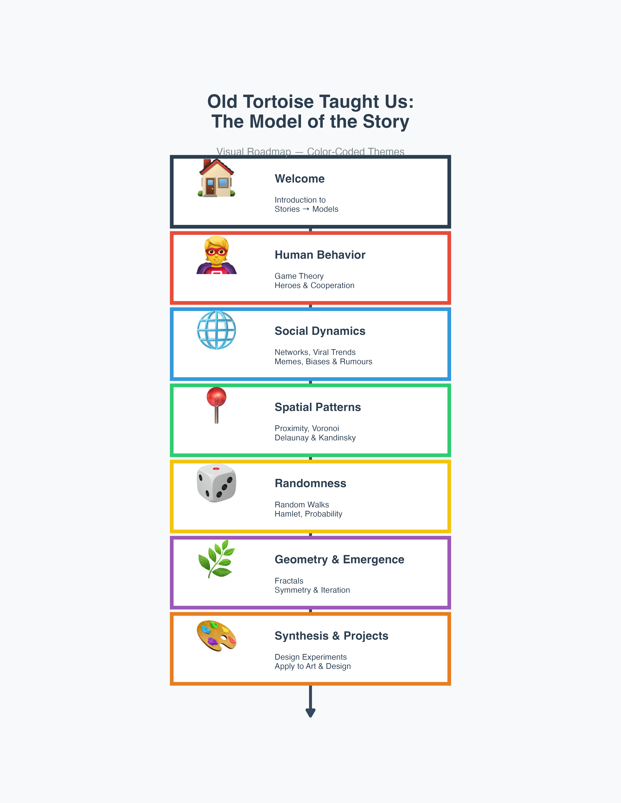
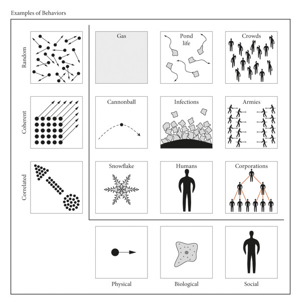

```{r}
#| echo: false
#| out.height: "40%"
#| out.width: "40%"
#| fig-align: "center"
#| fig-cap: "Clock at Grand Central Station, NY"
#| fig-alt: "Clock at Grand Central Station, NY"

knitr::include_graphics("featured.jpg")
```


## Introduction

> It can scarcely be denied that the supreme goal of all theory is to make the irreducible basic elements as simple and as few as possible without having to surrender the adequate representation of a single datum of experience. --- ALBERT EINSTEIN

> To become wise you've got to have models in your head. And you've got to array your experience---both vicarious and direct---on this latticework of models.--- CHARLIE MUNGER

> All Models Are Wrong But Some Are Useful. --- GEORGE BOX

>Humans possess a set of interacting traits connected to our unique capacities for ***cognition*** (how we think and reason), ***cooperation*** (how we work together), and ***culture*** (how we share and accumulate information). Through such abilities, we have acquired unprecedented powers to design and redesign our environments, but we have also become vulnerable to novel risks and failure modes. [--- Conspicuous Cognition Substack](https://www.conspicuouscognition.com/i/185756196/a-uniquely-unique-animal). 

## Course Abstract

In this Unit, we will take inspiration from [**Classic Literature, Poetry, Drama, and Paintings, and Music**]{.black .bg-gold} to contemplate certain **Human Experiences**. Using these as a starting point, we will create **Models** and make sense of these human experiences. 

These Models may resemble a [Theory, a Thought Experiment, a Diagram, a simple Procedure, a piece of Computer Code, or even a Cultural Tradition]{.black .bg-gold}. The Models will be understood, internalized, fitted in with what we already know, and **generalized** to new situations and applications. This will done with the help of activities based on [games, pranks, memes, videos, movies, movie-clips, art-related activities, open source software tools, interactives, field experiments, field visits, readings, additional readings, writings, more writings, still more writings, and seemingly endless discussions.]{.black .bg-gold}. 

The Models should thusly provide data and directions for artistic and design endeavours. In effect, we will go from [**Stories to Data**](https://open.spotify.com/episode/2DpA27VkXd0eVvcM4f3hTl?si=fa54cde8dd0044d0), rather than the other way around. 

At the end of the Unit, the ~~tired, but happy~~ students will use the gamut of Models / Tools / Techniques encountered in class to design an artifact or performance, working individually or in teams.

## What you will learn

-   **Complexity Science**: The so-called (by me!) [4-As]{.black .bg-gold} - the ***"Agents, Actions, Again, Aggregate"*** idea
-   **Complexity concepts** and how to identify them and apply them in practice
- **Complexity in Human Behaviour**:
    -   Game Theory: *Prisoners' Dilemma*, *Stag Hunt*, and *Chicken* Games
    -   *Coordination Games* and *Schelling Focus Points*; Public Behaviour and Policy
    -   Viral Trends, Biases, and Epidemics, and why you persist in saying *Bro*, *My Bad*, and *Think Different*🤦🤦🤦
    -   Spatial Patterns and Social Behaviour
-   **Complexity in Connections**:
    -   Network Structure
    -   Network Effects
    -   How the Spatial (Static) affects the Temporal (Behavioural) and vice versa
-   **Complexity in Geometry**:
    - Proximity
      - Delaunay and Voronoi Patterns
      - Spatial Pattern Emergence(again)
    - Fundamentals of Fractals
      - Repetition and Iterated Functions
      - Emergence of Shape(yet again)
      - Fractional Dimensions and Box Counting
      - Mandelbrot, Julia, and Barnsley Fractals
    - Symmetry
      - Canonical Movements at your fingertips
      - 1D, 2D, 3D symmetry: Friezes, Mosaics, and Cubes
      - *Symmetry on Average*: Probability meets Symmetry
      - Orientation and "Orientability"
    
-   **Complexity, Probability, and Randomness:**
    - Randomness and its manifestation in Real Life
      - Poisson Processes
    - Using Randomness as a Design Tool
      - Hypothesis Testing
      - Basics of Design of Experiments
      - Data Gathering and Analysis (aka "Primary Design Research")
    
-   **Complexity and Basics of Machine Learning Algorithms**
    -   Classification, Clustering, Regression
    -   Transformers(?)
    -   Interpretation of (some) ML/AI algorithms with ideas from Complexity

```{r}
#| echo: false
#| out.height: "820px"
#| eval: false



```


And, finally

-   [***Why all these #&%!@!#^%$ things matter in Art and Design***]{.black .bg-gold}, especially since you came here because you hated Maths in Class 8!!


## Some Teasers!!

1. Are we all Ants?


1. This century was named by Stephen Hawking as the [**Age of Complexity**](https://blogs.scientificamerican.com/the-curious-wavefunction/stephen-hawkings-advice-for-twenty-first-century-grads-embrace-complexity/).

:::: pa4
::: {.athelas .ml0 .mt0 .pl4 .black-90 .bl .bw2 .b--blue}
[A few years ago, Hawking was asked what he thought of the common opinion that the twentieth century was that of biology and the twenty-first century would be that of physics. Hawking replied that in his opinion the twenty-first century would be the "century of complexity". That remark probably holds more useful advice for contemporary students than they realize since it points to at least two skills which are going to be essential for new college grads in the age of complexity: statistics and data visualization.]{.f5 .f4-m .f3-l .lh-copy .measure
.mt0}

[--- Hawking]{.f6 .ttu .tracked .fs-normal}
:::
::::

2.  Documentary: [**The Secret Life of Chaos.**](https://topdocumentaryfilms.com/secret-life-chaos/)
3.  TED Talk: Benoit Mandelbrot. [**Fractals and the Art of Roughness.**](https://www.ted.com/talks/benoit_mandelbrot_fractals_and_the_art_of_roughness/transcript?language=en)
4. *Complexity Explorables* : A collection/playground of interactive explorable explanations of complex systems in biology, physics, mathematics, social sciences, epidemiology, ecology and other fields. <https://www.complexity-explorables.org>
5. Santa Fe Complexity Institute's *Complexity Explorer* (not the same as the one above!!) delivers online courses, tutorials, and resources essential to the study of complex systems. <https://www.complexityexplorer.org>
6. Siegenfeld, Alexander F., Bar-Yam, Yaneer.(2020). *An Introduction to Complex Systems Science and Its Applications*. Complexity, 2020, 6105872, 16 pages, 2020. https://doi.org/10.1155/2020/6105872. See @fig-complexity extracted from [this paper](https://onlinelibrary.wiley.com/doi/10.1155/2020/6105872), below. 

```{r}
#| echo: false
#| label: fig-complexity
#| fig-cap: "Complexity Phenomena and Behaviours"
#| fig-link: https://onlinelibrary.wiley.com/doi/10.1155/2020/6105872
#| out-width: "75%"
#| out-height: "75%"



```

7. [Gerry Rafferty (1979). *Baker Street*](https://jjmilt.substack.com/p/why-gerry-raffertys-lyrics-in-baker). 

That immortal sax by [Raphael Ravenscroft](https://www.bbc.com/news/uk-england-devon-29700432), yes. But the lyrics, the lyrics...

:::: {.grid}

::: {.g-col-6}
::: {style="text-align: center; font-size: 0.75em;"}

Winding your way down on Baker Street
Light in your head and dead on your feet
Well another crazy day, you'll drink the night away
And forget about everything

This city desert makes you feel so cold
It's got so many people but it's got no soul
And it's taken you so long to find out you were wrong
When you thought it held everything

You used to think that it was so easy
You used to say that it was so easy
But you're tryin', you're tryin' now
Another year and then you'd be happy
Just one more year and then you'd be happy
But you're cryin', you're cryin' now

Way down the street there's a light in his place
He opens the door, he's got that look on his face
And he asks you where you've been, you tell him who you've seen
And you talk about anything

He's got this dream about buyin' some land
He's gonna give up the booze and the one night stands
And then he'll settle down, it's a quiet little town
And forget about everything

But you know he'll always keep movin'
You know he's never gonna stop movin'
'Cause he's rollin', he's the rollin' stone
And when you wake up it's a new mornin'
The sun is shinin', it's a new mornin'
But you're going, you're going on..

:::
:::


::: {.g-col-6}



:::

::::


## Modules


